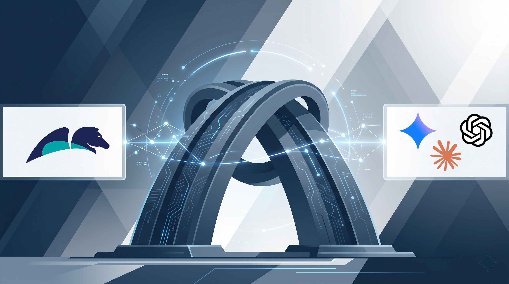

Imagine a trading floor, years ago, where two engineers ship code in the same week. The first writes a pricing engine people would still talk about. Elegant, fast, the kind of thing that gets a person promoted and quoted in the all-hands. The second writes a small integration job, late, under deadline, that looks clean in the demo and passes every eye in the room. It runs quietly for four months before it begins rounding a currency conversion the wrong way on a narrow set of trades. By the time anyone notices, the number that has leaked out the side of the system has a great many zeros in it.

Nobody would give a conference talk about the second engineer. That, in one sentence, is the problem with how we judge software.

The rule is simple, and almost nobody follows it: judge a system by the worst it will do in production at scale, not the best it can show you in a demo.

And yet we have always judged it by its best examples. The cathedral, never the collapse. And for thirty years that habit was survivable, because the people who could build the cathedral and the people who could cause the collapse were often the same people, working under the same roof, and we mostly got away with it.

## The trade we already made once

Think about what raw power actually bought us. A brilliant C++ or Java architect could produce a magnificent enterprise artifact. That was never in question. The question was the spread. Across a thousand developers of uneven skill, on deadlines, through turnover and reorganizations, what did the median application look like, and how bad was the worst one, and what did that worst one cost you when it failed an audit, leaked a record, or took down a settlement run on a Friday afternoon.

Raw language freedom gave you the highest ceiling and the most frightening floor. So the industry made a deliberate trade. The fourth-generation languages, the governed platforms, the model-driven tools with guardrails built in, all of them gave up some ceiling in exchange for a radically higher floor. The bargain was simple and unglamorous: the worst application a junior ships on a bad day is still auditable, still inside policy, still safe to put in front of a regulator. You do not measure a bargain like that by its best output. You measure it by its variance and its tail.

## The same trade, arriving again

Vibe coding is that same trade, walking back through the door. And the seduction this time is not the demo on the main stage. It is the one you ran yourself.

Picture the proof of concept your own team wired together from scratch, no platform underneath it, the one that lit up the boardroom and had everyone asking why the whole company could not move that fast. That demo is spectacular, and it is real. It is also a single sample drawn from the very top of your own distribution. A production estate is ten thousand samples, and the ones that hurt you are not the best one. They are the worst ten.

This is the part of the famous MIT number that almost everyone reads backward. When MIT's NANDA initiative reported that roughly ninety-five percent of enterprise generative AI pilots delivered no measurable return despite \$30 to \$40 billion in spending, most people heard "AI is hype." That is the lazy reading.

The more useful reading is that we are mesmerized by the five percent at the top and are not measuring the distribution at all. We are grading the technology by its cathedral and ignoring its floor.

So here is the question I would put to any leader walking into a keynote next week. Not "how good can AI-built software be." A demo already answered that. The question is "what does the worst thing my organization ships this quarter look like, and what is it allowed to touch." That is a risk officer's sentence, and it is the one that separates a serious enterprise strategy from a highlight reel.

## What the guardrails actually buy

A framework that builds in guardrails is a bet on the floor and on the tail. Said plainly, the platform does not make the best application better. It makes the worst application enterprise-grade by default, fully compatible with the security, compliance, and operational baseline your business already runs on. The floor is not a tolerance you learn to live with. It is the standard, applied to everything, including the work that was built in a hurry by someone who will never read the policy. In an estate of thousands of applications, and soon thousands of agents, that is not a minor feature. It is close to the whole game.

The concrete advantages stack up once you look for them rather than at them. Interoperability becomes a property of the platform instead of something every team hand-rolls and every team gets slightly wrong. Enterprise-grade quality becomes a structural guarantee of the spine rather than a heroic property of whoever happened to build that one module. And the governed case, the thing that carries the audit trail and the policy and the accountability, is now becoming natively callable: Pega has begun exposing the case itself through open agent standards like MCP and A2A, which means the floor does not stop at the platform boundary. It extends outward to whatever plugs in.

The most telling signal is coming from the other end of the field. On June 2, Anthropic shipped dynamic workflows in Claude Code, a capability that lets its model write and run its own deterministic workflow on the fly: it breaks a task into smaller agents and sets them to check one another, so the system cannot quietly declare a hard job finished when it is only two-thirds done. Read that again. The frontier is engineering a floor, reaching back from raw cognition toward determinism. The governed platform was already there, reaching the other way, toward cognition. Two serious builders, no incentive to imitate each other, arriving at the same shape because the structure of the problem forced them to. That is not fashion. It is closer to a law.

## Where the ceiling actually comes from

Here is what the demo-versus-floor framing misses, and it is the most hopeful part of the story. A high floor does not cap your ceiling. It changes where the ceiling gets built.

The creativity is still there. It moves to design time. This is the whole argument for AI-assisted design, and it is what Pega Blueprint does: you point cognition at the problem and let it imagine the most optimal way to use the platform, the smartest case design, the cleanest decision flow, the best-shaped process, and it does that imagining inside the guardrails rather than around them. The model is not improvising in production where a mistake is a breach. It is dreaming at the drafting table, where a bad idea costs nothing and a good one gets built on a foundation that is already deterministic, predictable, and auditable. The platform does make the best application better. It does it by letting the most powerful cognition we have design the system to the very edge of what the enterprise allows, and not one inch past it.

That is the trade done right. Raw cognition for the imagining, where the blast radius is a discarded draft. The governed spine for the running, where the blast radius is a regulator. You get the ceiling and the floor, because you stopped asking them to come from the same moment in the lifecycle.

The agent your team hand-wired from scratch inverts that. It does its improvising live, in production, with no floor underneath it, which is exactly why the demo thrilled you and the audit will not.

## The honest cost, and the real craft

I am not going to pretend a higher floor is free. It is paid for in tempo and in discipline. You are paced to the platform's release cycle rather than the frontier's, so the newest model trick reaches you a beat later than it reaches a team building raw. And the discipline is real: you have to do your inventing at design time and resist the pull to let an agent freelance in production because it would be faster this once. On the rare problem that is pure exploration, with nothing of the enterprise riding on it, that constraint is the wrong tool, and you should reach for raw cognition instead. That is a real cost, not a rounding error.

So the mature position was never "guardrails everywhere." It is to match the floor to the stakes. Give cognition raw freedom where the blast radius is small and the upside is exploration. Hold the governed spine where the worst case is a regulator, a breach, or a life. The actual craft of the senior architect, the part that does not get automated, is drawing that line and owning it. I spend my days on both sides of it, building agentic systems and helping large regulated enterprises put them into production, and I have yet to meet a problem where the right answer was "trust the ceiling and skip the floor."

Here is the claim I will put my name to, with a condition that could prove me wrong. If, by the end of 2027, the organizations that gave AI the most ungoverned freedom are showing lower incident rates, lower audit-failure rates, and lower breach costs than the ones that kept it on governed rails, then I have this exactly backward and I will say so in writing. I do not think that is how it goes. I think the floor wins the decade, quietly, the way floors always do.

Next week, a few thousand of us gather in Las Vegas, and a great many demos will earn their applause. They should. But watch what your own mind does in the dark of that room. Somewhere in the third or fourth demo, a quiet thought arrives: amazing, but could I not build that exact outcome myself, with my two best engineers, or an FDE consultant in a good Claude Code session over a couple of days? You probably could. The ceiling is reachable. That is precisely the moment to stop and think about the floor.

Ask the real question instead. What is the platform under this demo guaranteeing that my version would quietly skip. The audit trail that holds when a regulator pulls the thread. The access control that does not depend on someone remembering to add it. The deterministic case lifecycle, the compliance baseline, the operational behavior under load, the thousand boring assurances that are invisible in a demo and decisive in production. Your hack can match the ceiling. It will almost never match the floor, because nothing underneath it was built to guarantee one.

So judge the alternative the way you should judge all of this. Not on the best it can do in a demo. On the worst it will do at scale, and what it is allowed to touch when it does. If that is already the question you carry into the room, come find me. I love talking about ceilings, and I could not be more excited to be part of the company showing them off next week. I just happen to believe it is our awareness of the floor that makes those ceilings worth the applause.
