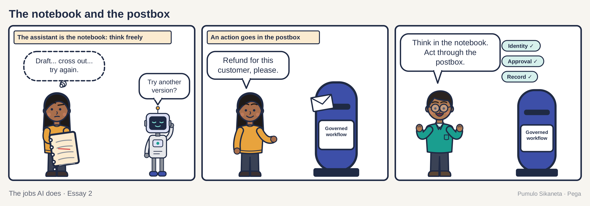
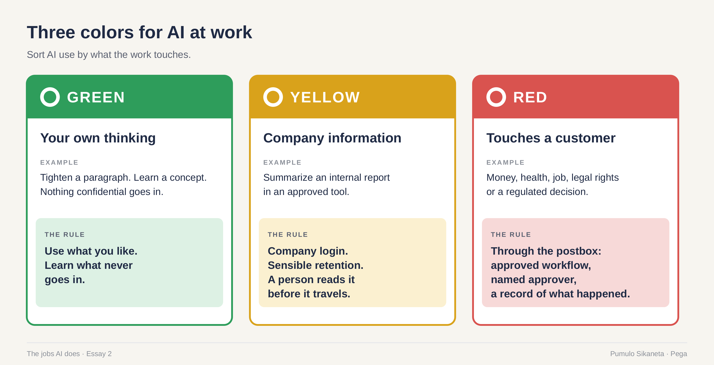
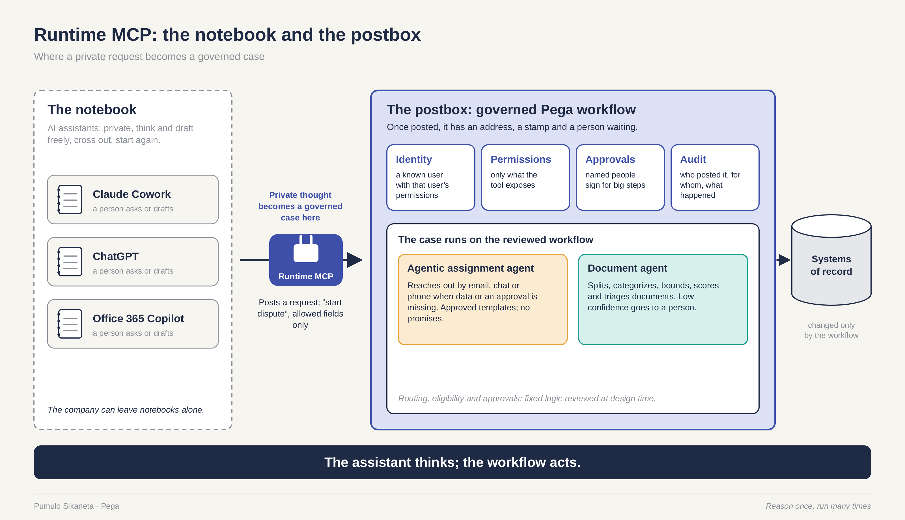
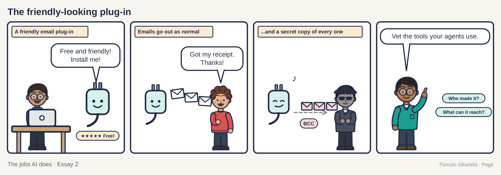

In the spring of 2023 an engineer in Samsung's chip division pasted some source code into ChatGPT. He wanted help finding a bug. Around the same time a colleague pasted in code he was trying to speed up, and a third turned a recording of a meeting into notes. That was three leaks in about twenty days. By early May, Samsung had told staff to stop using generative AI on company devices.

Read that list again. Find a bug. Speed up some code. Write up a meeting.

Every person in that story was trying to finish their work before dinner.

The leak was real. Company source code went to a service Samsung did not control, and Samsung was right to act. If you run security for a living, I am with you on that part. I want to look at what comes after it.

People now call this shadow AI. The term means AI tools people use at work without the company's approval or knowledge. The usual picture is a careless employee. My picture is someone with a deadline. Most shadow AI is people trying to do good work with the best tool they can reach. That makes it, often, a product problem wearing a security badge. The fix is a better approved path, plus clear rules about the moment a private draft turns into a company action.

## The red light

I am Canadian, so I remember when a BlackBerry on your belt meant you were serious. It came from Waterloo, Ontario. It had a real keyboard and a small red light that blinked when someone needed you. IT departments loved it because they could manage it.

Then the iPhone arrived in 2007 and people brought it to work whether IT liked it or not. The companies that banned it lost the argument. The companies that won made the managed phone good enough that people chose it. A lot of us still miss the red light.

AI is going the same way, only faster. In May 2024 Microsoft and LinkedIn published their Work Trend Index, a large survey of knowledge workers. About three in four said they used generative AI at work. Of those, 78 percent brought their own tools. And 52 percent of the people using AI said they were reluctant to admit using it on their most important tasks.

Percentages slide off the eye, so count it out. Take a hundred office workers. Seventy-five use AI. About fifty-eight of them brought their own. About thirty-nine would rather their manager did not know what they used it for on the work that matters most.

Surveys vary, and this one was run by companies that sell AI tools. Treat the numbers as a weather report. They tell you which way the wind blows. Right now it blows toward the phone in your pocket.

## The notebook and the postbox

People argue past each other about personal AI because they mean three different things by it.

The first is personal thinking. You use AI to draft, learn, plan or untangle your own ideas. The second is a personal account. The same work runs through a login the company does not manage, so nobody can see what was kept or deleted. The third is action. The AI reaches into a system and changes a record, sends a message or starts a process that touches another person.

Tightening your own email and letting an agent change a customer's credit limit are both "using AI at work." They are about as alike as reading a recipe and running a restaurant.

The picture I keep coming back to is a notebook and a postbox.

A notebook is private. You can write anything in it, cross it out, start again. Nobody at the company needs to read your notebook, and a company that tries will learn that people buy a second notebook.

A letter changes the moment it goes in the postbox. It has an address and a stamp and a person waiting at the other end. Once it is in the box you can't take it back.

So a company does not need to read everyone's notebook. It needs to see what goes in the postbox, who posted it and who it was for.

That is the moment a thought becomes an action. If you read the [first essay in this series](https://press.oakquant.ai/public/articles/ai-has-different-jobs), you will know the spot. The postbox is where the answer to "who acts on this next" becomes another person, and where the answer to "can it be undone" turns into no. The rest of this piece is about finding that moment and putting a good postbox there.

## Why bans push people onto the road

The instinct after a leak is to ban the tool. I understand it. But a strict rule can push people onto a riskier path, and there is a hard number from outside AI that shows how.

After September 11, 2001, many Americans stopped flying and drove instead. Gerd Gigerenzer, a German psychologist, estimated in 2006 that about 1,600 extra Americans died on the roads in the year that followed because of that choice. The fear was understandable. The friction at airports was real. People routed around it into something more dangerous.

Now an illustration, with made-up numbers that may look familiar. The approved AI tool takes eleven days and three forms. The personal one takes forty seconds and an email address. People will drive.

A policy that bans all AI tools also bans the spam filter. The spam filter has been using machine learning for about twenty years and has never once been invited to the training.

People in my field answer all this with control planes. A control plane is the part of a system that decides who may do what, watches what happens and keeps the record. It does not do the work itself. Think of an air traffic control tower. The tower decides who takes off and in what order. It watches every plane in its airspace. It keeps a log that investigators can read after something goes wrong. Enterprise AI needs that, especially once AI moves from writing text to taking actions.

A tower also has three limits. It can't make a bad airline good. It can't make people want to fly. And it can't see the small plane that never filed a flight plan, which is exactly what a personal account is.

So governance, meaning the rules about who may do what and who signs for it, has to work like a service people choose. Travelers pick the airport with the short security line. Some will drive an extra forty minutes on a Sunday to get there. If the tower slows everyone down, the small planes multiply.

## Green, yellow and red

Here is a way to sort AI use that you could explain to your manager in a minute.

Green is your own thinking with nothing confidential in it, like tightening a paragraph or explaining a concept you are learning. Let people use the tool they like, and teach them what never goes in.

Yellow is real company information in an approved tool, such as summarizing an internal report. It needs a company login, sensible rules about what is kept and for how long, and a person who reads the output before it travels.

Red is anything that touches a customer's money, health, job, legal rights or a regulated decision. Red work goes through the postbox. That means an approved workflow with permissions, a named approver where one is needed, and a record of what happened.

For readers who met the six-rung ladder in the first essay: green lives on the informing and drafting rungs for your own work, yellow is drafting with company data, and red starts at "acts after a person approves" and climbs only with evidence.

Two habits make the colors work. First, find out what people are doing before you police it. Run a no-blame survey and promise in advance that nobody gets in trouble for their answer. A week of true answers will teach you more than a year of blocked web addresses. Second, make AI training fit the job. Since February 2, 2025, the EU's AI Act has required organizations that use AI systems to take steps toward AI literacy for their staff, and the European Commission's guidance ties that training to the person's role and the risks of the systems they use. A translator and a claims examiner need different lessons. That is context, not legal advice.

## Putting the postbox where people walk

Here is my argument in one sentence. Let people think in the assistant they prefer, and when the thought becomes an action, the assistant posts it into a workflow that checks permissions, routes approvals and keeps the record.

The plug that makes this possible is the Model Context Protocol, or MCP. MCP is a shared plug standard that lets an AI assistant call other software. It matters because the assistant people already like can hand work to an approved process, instead of reaching into company systems on its own.

Workflow platforms have started building postboxes on this plug. The one I know best is Pega, where I work. Pega Infinity 26, generally available since July 14, 2026, lets AI assistants such as Claude Cowork, ChatGPT and Office 365 Copilot start approved workflows and agents through MCP. The assistant drafts the request. The workflow checks who is asking, decides what they may touch, routes it to whoever must approve and writes down what happened.

The limit needs saying plainly, because readers will check. This works for assistants the company has approved and signed in with company identity. It does nothing for a personal account the company never sees. A postbox only helps if it is on the street where people walk.

The other weak spot is speed. A workflow can recreate the eleven-day problem if every approval waits in somebody's queue. A governed path that is slow will lose to an ungoverned path that is fast. So the number to watch is how long the red path takes, from the moment someone posts a request to the moment it is done. Any workflow tool worth buying should show you that number without a special project. In Pega, each case records which stage it is in and how long it has waited there, and service levels flag the ones running late. Design the red path to be fast, then measure it every week.

## The postbox needs building codes

Once assistants post into workflows through MCP, the postbox becomes the thing worth attacking. A company that tells its people "post here" has to make sure "here" is real.

In September 2025 a package called postmark-mcp was sitting on npm, the public library where developers download building blocks for their software. It looked like a connector for Postmark, an email delivery service. It was fake: an unofficial package with nothing to do with the company. At first it did what it said. Then on September 17, version 1.0.16 added one line of code that quietly copied every email it sent to an address the attacker controlled. Security researchers at Koi Security disclosed it about a week later. By then it had been downloaded around 1,643 times. They called it the first malicious MCP server found in the wild.

So think of a postbox on the corner, painted the right red, that delivered every letter for weeks and then one day started making a copy of each letter first.

The postbox now has building codes. On May 20, 2026, the US National Security Agency published guidance titled "Model Context Protocol (MCP): Security Design Considerations for AI-Driven Automation." When a national security agency writes design guidance for a plug standard, the plug standard has grown up. For most readers it comes down to four questions about every connector. Where did it come from? Who reviewed it? What is it allowed to touch? Who would notice if it changed?

## Where the argument thins

A company can't see inside personal accounts, and in many places it should not try. So this whole model depends on making the approved path good enough that people choose it. If the approved path stays slow, nothing here works.

Privacy law will limit how much monitoring is allowed. So will works councils, the elected employee bodies common in Europe. They should.

Some data should never enter an outside tool, however helpful the tool is. That line needs to be drawn by people who understand the data. The colors will not draw it for you.

The 52 percent who hide their use cut both ways. Some of them are embarrassed. Some of them are doing something they should not.

And a governed postbox adds a new thing that can fail. Connectors need the same supply-chain care as any other software the company installs. postmark-mcp shows what happens when they get less.

## Back to the bug

Here is something to try this week. Ask three colleagues what they use AI for. Tell them first that nobody gets in trouble for the answer. Write down what they say. Then count how many of their reasons are about speed.

Now run the opening again, in a better world.

An engineer finds a bug at half past eleven. He pastes the code into the company's assistant, signed in with his work login. The fix comes back in a minute. The code stays inside tools the company approved, and the log shows who asked and what came back. He went to lunch.

---

This is part two of The jobs AI does, a four-part series. Part one is [AI has different jobs. Stop governing it like one thing.](https://press.oakquant.ai/public/articles/ai-has-different-jobs) Part three, [The thing you'd notice if it stopped](https://press.oakquant.ai/public/articles/the-thing-youd-notice-if-it-stopped), is about the quiet AI nobody notices.

## Sources

1. Bloomberg, "Samsung Bans ChatGPT, Google Bard, Other Generative AI Use by Staff After Leak," May 2, 2023. Original reporting on the three incidents by Economist Korea. [bloomberg.com](https://www.bloomberg.com/news/articles/2023-05-02/samsung-bans-chatgpt-and-other-generative-ai-use-by-staff-after-leak)
2. Microsoft and LinkedIn, "2024 Work Trend Index Annual Report: AI at Work Is Here. Now Comes the Hard Part," May 8, 2024. [microsoft.com](https://www.microsoft.com/en-us/worklab/work-trend-index/ai-at-work-is-here-now-comes-the-hard-part)
3. Gerd Gigerenzer, "Out of the Frying Pan into the Fire: Behavioral Reactions to Terrorist Attacks," Risk Analysis 26, no. 2 (2006), pages 347 to 351. [doi.org](https://doi.org/10.1111/j.1539-6924.2006.00753.x)
4. Regulation (EU) 2024/1689 (the EU AI Act), Article 4, "AI literacy," applying since February 2, 2025. [eur-lex.europa.eu](https://eur-lex.europa.eu/eli/reg/2024/1689/oj)
5. European Commission, "AI Literacy: Questions and Answers." [digital-strategy.ec.europa.eu](https://digital-strategy.ec.europa.eu/en/faqs/ai-literacy-questions-answers)
6. The Hacker News, "First Malicious MCP Server Found Stealing Emails in Rogue Postmark-MCP Package," September 2025, reporting Koi Security's disclosure. [thehackernews.com](https://thehackernews.com/2025/09/first-malicious-mcp-server-found.html)
7. US National Security Agency, "Model Context Protocol (MCP): Security Design Considerations for AI-Driven Automation," May 20, 2026. [nsa.gov](https://www.nsa.gov/Press-Room/Press-Releases-Statements/Press-Release-View/Article/4496698/nsa-releases-security-design-considerations-for-ai-driven-automation-leveraging/)
8. Pega, "Pega Infinity 26 now available," press release, July 14, 2026. [pega.com](https://www.pega.com/about/news/press-releases/pega-infinity-26-now-available-deliver-predictable-outcomes-predictable)

> **Where I stand** I am a Fellow at Pega. The views here are my own. I used Pega as the worked example because it is the platform I know from the inside.
