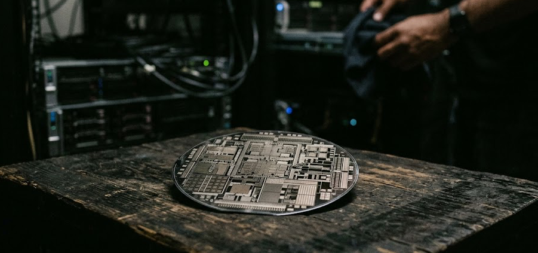

In late June, a man most people outside the chip industry have never heard of walked into OpenAI's offices, carrying a piece of silicon roughly the size of a coaster, and handed it across a table to Sam Altman and Greg Brockman.

His name is Hock Tan. He runs Broadcom, a company most of the public could not pick out of a lineup.

There was a camera, of course. There always is. The image was meant to read as a milestone: OpenAI's first custom chip, a company graduating from buyer to builder. And it was that. But look at the staging again. The men receiving the wafer run the most famous AI company on earth. The man handing it over runs a business most people couldn't name. In the photograph, the celebrities are the ones holding out their hands.

That is the whole story, if you know how to read it.

For three years we have been trained to watch the prospectors: the labs with the dazzling demos, the founders on magazine covers, the leaderboard that reshuffles every few weeks. We have been told the AI competition belongs entirely to the models. It is not, or it is no longer. The race has descended, quietly, from the model layer into the basement, down to the chips and the power lines and the copper that connects them. And down there, a different kind of company is getting rich. Not by winning the war. By selling to everyone fighting it.

The chip is called Jalapeño. To understand why it matters, you have to stop watching the men holding it and start watching the man who walked it in.

## The shovel sellers

Every gold rush teaches the same lesson, and almost nobody learns it in time.

When word reached the world that there was gold in California, a hundred thousand people sold everything and ran toward the same mountains. Most of them found very little. The fortunes that lasted were made by the people who never picked up a pan. Samuel Brannan bought every shovel, pick, and pan he could find, then stood in the street shouting about gold, not to join the dig but to sell the diggers their tools at a markup. Levi Strauss didn't strike a single vein. He sold the miners trousers that didn't fall apart. The prospectors chased the gold. The suppliers *sold the chase itself*, which is a far better business, because the chase never runs dry even when the gold does.

For most of this decade, Nvidia has been the shovel seller of the AI rush, and it has been the greatest one in commercial history.

If you wanted to build a frontier model, you bought Nvidia. If you wanted to scale, you bought more Nvidia. If you wanted to stay in the race at all, you prayed you could get to the front of the line before a better-funded rival bought the supply out from under you. Nvidia wasn't selling chips so much as selling *admission to the frontier*. And it could name its price, because there was only one door and everyone was trying to get through it at once. That is how a company that makes components became, for a stretch, the most valuable enterprise on the planet.

But every gold rush curdles the same way. Once the first frenzy cools, the miners stop marveling at the gold and start doing arithmetic. They notice exactly how much of their haul is going to the man who sold them the shovel. And they start wondering whether they couldn't just make their own.

## The toll gets too high

By 2026, the arithmetic had become impossible to ignore.

The biggest labs in the world had built their empires on rented silicon, and the rent was crushing. Running a model like ChatGPT at planetary scale means answering billions of queries a day, and almost every one of those answers traced back, somewhere in the stack, to hardware from a single supplier. Every token carried a toll. And the people paying it had begun to say so out loud. As one analyst put it, watching the hyperscalers scramble to diversify: nobody wants to be beholden to Nvidia.

There were three separate problems hiding inside that one sentence, and they compounded.

The first was simply price. When one company is the only road to the frontier, it collects a toll on everyone traveling it, and the toll becomes a tax on your entire future.

The second was supply. The most important companies in the world had discovered that their growth was hostage to someone else's factory schedule. They could be choked not by a lack of ideas but by a lack of chips.

The third was the deepest, and the most strategic. A company running what it believes will be the most consequential technology in history does not, in its bones, want to depend forever on an outside vendor for the machines that make it run. Dependence at that scale isn't a line item. It's a vulnerability written into the foundation.

So the biggest buyers began to split the problem in two, and the smartest of them had started years ago. Google had quietly spent years building its own AI chips, called TPUs. Amazon had built its own, called Trainium. The largest customers of Nvidia's shovels were already turning into shovel-makers themselves, one workload at a time. OpenAI was only the most visible company to say out loud what the others had been doing in private. This split is the key that unlocks everything else.

## The prestige war and the grinding war

There are two wars happening in AI hardware, and they could not be more different in character.

The first is **training**: building the model. Training is the prestige layer, the part with the grand announcements and the record-breaking clusters and the technical feats that get written up like moon landings. It is glamorous, it is expensive, and Nvidia still owns it almost completely. This is the war everyone watches.

The second is **inference**: running the model after it's built. Inference is the unglamorous part, the actual serving of answers, code, images, and actions to real users, billions of times a day, forever. It is the logistics war. And logistics, as every general eventually learns, is where wars are actually won or lost.

Here is the thing about inference. It is the same narrow task, repeated to the point of monotony, at unfathomable volume. And general-purpose hardware, a brilliant flexible chip that can do anything, is almost never the cheapest way to do one thing a billion times. If you understand your own workload intimately enough, you eventually stop wanting a Swiss Army knife and start wanting a single, perfect blade, forged for exactly your cut.

That craving, for the purpose-built blade instead of the rented multitool, is the entire logic of Jalapeño.

## Enter the chip with the kick

Jalapeño is not a science-fair trophy and it is not a frontal assault on Nvidia. It is something more disciplined: a chip built to do one thing, serve OpenAI's models, cheaper and faster than a general-purpose GPU ever could.

The details are genuinely arresting. OpenAI designed it from a blank sheet around exactly how its own inference workloads behave, and brought it from first sketch to manufacturing in roughly nine months. In an industry where chips normally gestate for two or three years, that pace sounds less like engineering and more like alchemy. They did it in part by turning their own models loose on the design problem: the AI helped build the machine that will run the AI. Early samples, by the company's own account, cut the cost of inference by something close to half against a standard GPU. Broadcom supplied the silicon implementation and the networking fabric that ties the racks together; TSMC fabricated it; Celestica built the systems around it. The first chip is only the opening move in a multi-generation roadmap meant to scale toward ten gigawatts of computing power, enough to run a small country.

But the engineering is not the point. The *declaration* is the point.

With Jalapeño, OpenAI is saying something that should reorganize how you think about this entire industry: a frontier lab can no longer afford to think only at the model layer. The economics have forced it downward, into the silicon. When serving your models costs enough, and your dependence on one supplier runs deep enough, you eventually stop optimizing the software and start redesigning the machine. The next chapter of this competition will be fought in custom chips, networking fabric, rack architecture, energy contracts, and raw system efficiency: the boring, decisive infrastructure of war.

And every lab that reaches that conclusion has to walk through the same door to act on it. Which brings us, at last, to the man with the wafer.

## The arms dealer

In *Lord of War*, Nicolas Cage plays a man who sells weapons to every side of every conflict he can reach. He doesn't lead an army. He doesn't wear a uniform. He doesn't particularly care who wins. Caring who wins would be bad for business. His genius is structural: many armies need him, and his fortunes rise precisely when the fighting intensifies, because rivals at each other's throats keep buying ever more sophisticated equipment. Instability isn't a risk to his business; it's the very foundation of it.

That is Broadcom's position in AI, and it is a stranger, stronger position than Nvidia's.

Broadcom is not trying to build ChatGPT. It will never be the public face of anything. It has quietly made itself the company that helps the giants build their own weapons. It is the partner you call when you've decided you can no longer afford to depend on someone else's chip. And the beauty of that role is that it pays out in every possible future.

If OpenAI wants to escape Nvidia, it needs Broadcom to do it. If Google wants its own path, Broadcom can pave it. If Meta or Amazon or anyone else wants hardware independence, the road to independence runs straight through the arms dealer. Broadcom's chief executive recently described demand from the company's roster of custom-silicon customers with a single word: *insatiable*. He expects it to keep climbing for years. Of course he does. Every lab's bid for freedom from one supplier is a new sale for him.

Consider the asymmetry. Nvidia got rich because everyone wanted the *same* tool. Broadcom gets rich because everyone has decided they need a *different* one, and the act of becoming different has to be purchased from him. Nvidia profits when the industry agrees. Broadcom profits when it fractures. And a fracturing industry is the one we now live in: OpenAI alone has hedged its bets across deals with Amazon's chips, AMD, Cerebras, and now its own Broadcom-built silicon. Every one of those hedges is a crack in Nvidia's monopoly, and an arms dealer makes his living in the cracks.

None of this makes the arms dealer invulnerable, and it is worth being honest about where his position is thinner than it looks. His customer list is short. A handful of giant buyers account for most of the demand, and the loss of even one would leave a crater. The weapons he sells are also cheaper than the ones they replace, which means the very substitution he profits from quietly compresses the fat margins the whole industry has been feasting on. And every customer he teaches to design a chip learns, eventually, to need him a little less. The arms dealer's best customers are the ones most determined to stop being customers at all. His bet is that the war outlasts their independence. So far it has.

## Whoever controls the spice

There's an older story than the gold rush that fits even better.

In *Dune*, the visible drama is all kings and messiahs and noble houses scheming for a throne. But the real power in that universe never sits on the throne. It belongs to whoever controls the spice, the scarce substance that makes everything else possible. He who controls the spice controls the empire, not because he commands armies, but because every army, every fleet, every ambition depends on the thing only he can supply. The houses fight in the foreground. The substrate decides who can fight at all.

In AI, compute has become spice.

Watch the foreground and you see a glittering contest of protagonists: OpenAI, Google, Anthropic, Meta, each with its models and its mission and its valuation. Look beneath them and you find the actual architecture of power: the chips, the energy, the interconnects, and the handful of firms able to redesign the stack from the bottom. The labs are the noble houses. The companies controlling the silicon and the substrate are something quieter and more permanent. They don't need to win the war in the foreground. They've already won the one underneath it.

## This is not a story about Nvidia losing

It would be neat to end with Nvidia's fall, but the truth is more interesting than that.

In the near term, Jalapeño is a sign of Nvidia's *strength*. Demand for AI compute has grown so enormous that the largest buyers are now building second and third lanes of hardware *on top of* their existing GPU spend, not instead of it. The market isn't shrinking. It's overflowing so violently that no single supplier can contain it. That is exactly why the overflow has to find new channels, and why the arms dealer's phone won't stop ringing.

The long-term danger is subtler. If the world of inference quietly detaches from the world of training, the giants may keep buying Nvidia where they must, for the prestige war, the training clusters, the moon landings, while migrating the endless, grinding serving workloads onto custom silicon they control. Nvidia keeps the glamorous front line. Broadcom takes the logistics. And as every quartermaster knows, the front line gets the poster, but logistics decides the outcome.

## The lesson, for everyone who builds

Strip away the metaphors and a single hard idea remains, and it matters far beyond chips.

Dependency in AI is becoming *architectural* rather than contractual. It used to be that your exposure to a vendor lived in a contract you could renegotiate. Now it lives in the physical stack itself, in chips and power and interconnects that sit several layers below anything a strategy deck usually admits to. If your AI future rests on a few providers, who rest on a few hardware pathways, who rest on a few suppliers of the substrate, then your real risk is buried far deeper than you think. You don't control it. You may not even be able to see it.

There is also a question the arms dealer cannot answer for himself. A supplier who sells to every side is, by definition, a supplier no government wants pointed at its rivals. The moment a chokepoint becomes this important, neutrality stops being a business choice and becomes a thing states contest. Export controls already decide which buyers a chipmaker is allowed to serve and which it is forbidden to touch. Subsidy races and national-champion programs are bids to pull the armory inside one country's borders. The arms dealer in the films answers to no flag. The real one answers to license regimes, security reviews, and the quiet understanding that any supplier too important to fail is also too important to be left fully independent. He does not pick a side. Sooner or later, a side picks him.

For policymakers, the implication is sharper still: frontier AI has stopped being a software industry. It is becoming national infrastructure, a matter of industrial policy, energy security, and geopolitical leverage, decided in fabrication plants and power-purchase agreements rather than in app stores.

And for anyone trying to understand where this is all heading, the rule is the same one the gold rush taught and almost nobody learned in time. Power, as a revolution matures, drains away from the visible builders and pools quietly around whoever controls the bottleneck. First the attention goes to the prospectors. Then, if you're paying attention, you notice the people selling the shovels.

But the smart money has already moved past both. It's watching the man who walked the wafer in, the one who doesn't pick a side, because he's already armed all of them.

## Sources

- OpenAI, ["OpenAI and Broadcom unveil Jalapeño"](https://openai.com/index/openai-broadcom-jalapeno-inference-chip/): the chip announcement, the nine-month build, and the performance-per-watt claims.
- CNBC, ["OpenAI and Broadcom reveal Jalapeño, first AI chip in partnership"](https://www.cnbc.com/2026/06/24/openai-and-broadcom-reveal-jalapeno-first-ai-chip-in-partnership.html): the roughly 50 percent inference cost figure and Hock Tan's comments on insatiable demand.
- OpenAI Podcast Ep. 8, ["OpenAI x Broadcom"](https://www.youtube.com/watch?v=qqAbVTFnfk8): the October 2025 conversation announcing the partnership, with Altman, Brockman, Tan, and Kawwas.
