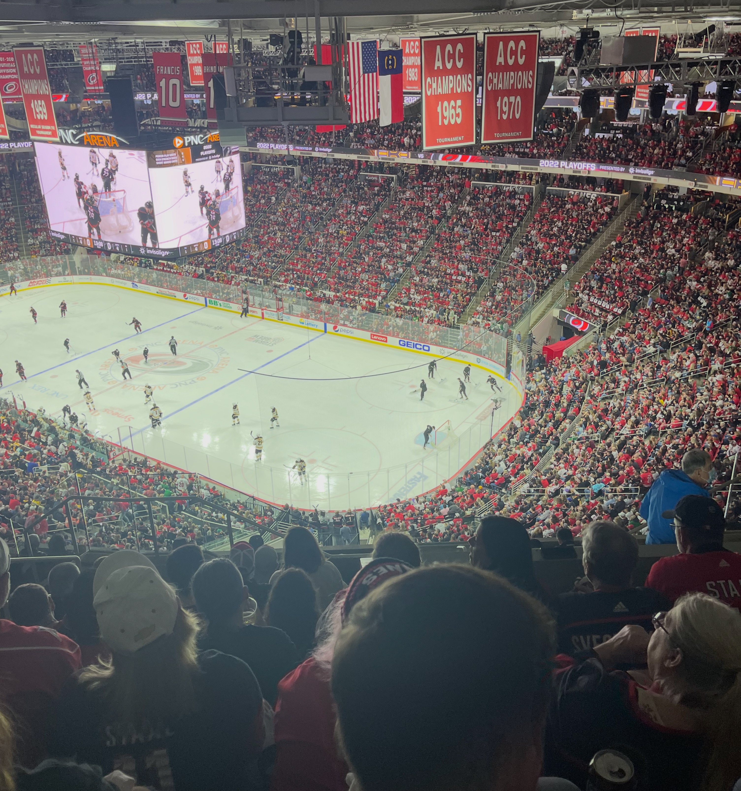

The cup was luck in all its jackets.

From the outside, that is the simplest way to tell the story. The Carolina Hurricanes went into Las Vegas and won Game 6. The horn sounded, the clock hit zero, and for the second time in franchise history, a team in red and black lifted the Stanley Cup. The highlight reels will package it neatly. A few big saves, a few big goals, confetti from the rafters, and a slow-motion shot of a captain finally raising silver over his head.

If you live in Raleigh right now, that version is everywhere. It is on jumbotrons and lamp posts, in shop windows and school hallways. The parade route is printed on maps up and down Fayetteville Street. Parents are keeping kids home from part of school so they can stand on the curb and watch the bus go by. It feels, in the best sense of the word, like a city that got lucky.

But every person in that locker room knows a different truth.

They know the cup was luck in all its jackets. Jackets you would not necessarily choose if you were writing your own script. Jackets that do not all look like victory. Jackets that have more to do with work and grace than with the neat arrow of a story that begins and ends in triumph.

Here is the thing that makes the word luck so easy to misread. Luck is real. It is not a myth the successful tell so they can sound humble. But luck never arrives on a bare body. It lands on whatever work was already there to catch it, and it fits like a tailored jacket only because someone spent years being measured for it without knowing they were. That is the version of this story worth telling, and it is not only a story about hockey. Everyone reading this owns a jacket like it, folded somewhere within reach.

## The jacket on Bussi's shoulders

There is a special kind of luck that looks, from the stands, like a sudden promotion, and from the inside, like a door that took too long to open.

Pyotr Kochetkov and Frederik Andersen were supposed to be the names everyone knew when the season started. The depth chart was not drawn with Brandon Bussi in thick ink. He was one of those names that live on the margin of rosters for a long time, riding buses, playing in small barns, working with coaches who know they may never see him under the brightest lights.

And then the strange arithmetic of a long season did what it always does. Bodies wore down. Timelines shifted. The safe assumptions built into preseason previews began to fray. Suddenly the margin player was packing for Raleigh, then for the playoffs, then for the Final, and then, on the last night of all, he was the one in the net when the horn sounded.

From the stands, his minutes looked like luck. A bounce here, an injury there, a career that could have stayed in the AHL forever catching a gust of wind at exactly the right time.

From his side of the glass, it looked like years of work nobody filmed.

It looked like staying late when no one was counting his reps. It looked like quietly rebuilding confidence after every call-down. It looked like treating every practice in Bridgeport or Springfield or Chicago as though someone might be watching, even on nights when nobody was.

When the call finally came, he did not suddenly become good. He became visible. The harder he had worked, the more there was for that visibility to land on. His jacket of luck was stitched from bus rides, drills, and all the mornings he chose to believe that being ready still mattered, even when the calendar tried to tell him otherwise.

## The jacket on Andersen's arm

There is another kind of luck that feels nothing like a blessing when it arrives.

Frederik Andersen's story is already a part of this franchise's heartbeat. The veteran who battled blood clots, walked into hospitals instead of arenas, and fought through the kind of fear that does not show up on a highlight package. The goalie who has, more than once, had to win his own net back from younger men and from his own body.

He had to win it back again this year. The regular season was unkind to him. The numbers sagged, a rookie played his way into the crease, and by spring the safe assumption was that Andersen would be the steadying veteran behind the kid rather than the man himself.

Then the playoffs came, and for two months he was the best version of his story. He carried this team through three rounds. Three shutouts. A goals-against under two. He shut the door on Montreal to send Carolina to the Final, and somewhere in those weeks his name began to appear in the same sentences as the Conn Smythe. After everything, the storybook seemed to be writing itself around him at last.

And then, at the very summit, his game left him.

It happened in the Final, against Vegas, on the largest stage the sport has. The pucks that had been hitting him started going past. He was pulled in the middle of a game he could not save. And the young goalie who had taken his net once before, in the depth of the regular season, took it again, for the games that decided everything, and did not give it back.

So the last images of his season are not the ones a goalie of his story would have drawn. They are of Andersen on the bench. In the handshake line. Third in the order at an optional skate while a rookie dressed to win the Cup.

From a certain angle, that is the cruelest luck in the room. To climb all the way back, to stand inches from the exact ending you spent a career imagining, and to feel it slip in the final chapter, in front of everyone.

The reality was quieter, and in some ways more beautiful.

He showed up anyway.

He showed up in practices, in meetings, in the spaces between periods where a sentence from the right person can settle a shaking room. He showed up for the very player who had replaced him. He showed up with a real smile when the cup finally changed hands, even though some private part of him had every right to mourn the version where he was the one raising it.

His jacket of luck was not the one he wanted. Underneath, it was the luck of still being here at all. Of a body that recovered enough to make the climb. Of getting close enough to the summit to breathe its air. And it was the harder, rarer luck of choosing grace at the precise moment narrative would have forgiven bitterness.

We like to talk about luck as if it is evenly warm. Andersen reminds us that sometimes the luck you get is the chance to respond well when the script turns on you one chapter from the end.

## The jacket on everyone around them

If we keep walking around the room, the fabrics change but the pattern does not.

Jordan Staal finally lifting the cup again, seventeen years after the first, and being named the oldest playoff MVP the league has ever crowned. From the stands that looked like a storybook coronation, a captain handed his moment at exactly the right time. From his side of the glass it looked like fourteen hundred games of the same faceoffs and the same quiet two-way work, finally arriving all at once.

Rod Brind'Amour tasting a championship as a coach after eight seasons teaching this room what it meant to be a Hurricane, two decades after he lifted the same cup as their captain.

Eric Tulsky, the former blogger and analyst who turned spreadsheets and stubbornness into a front office philosophy strong enough to survive the league's weather.

Every one of them wears a different jacket of luck.

There is the luck of staying healthy long enough for hard work to compound. The luck of being hired by an organization willing to give your ideas time. The luck of a marriage or a family that holds steady while you chase a silver object around the continent.

Around them are jackets no broadcast will name: equipment managers who know every routine, athletic trainers who catch small things before they become surgeries, ticket reps who lived through the lean years and kept dialing. The people who make the building feel like a place worth working hard for, even on ordinary Tuesdays in February when nobody thinks about June.

None of those jobs look like luck when you are doing them. They look like upkeep.

They look like showing up on time, again. They look like washing and taping and rehabbing and scheduling. They look like one more phone call, one more treatment, one more sheet of film. It is only in hindsight, under a shower of confetti, that anyone thinks to call it fortune.

## The jacket on a city's shoulders

Step outside the bus and onto Fayetteville Street, and the jackets keep multiplying.

There is the kid on someone's shoulders, waving a homemade sign with uneven letters. There is the bartender who has been pouring drinks through winning streaks and slumps. There is the teacher who recalibrated Monday's lesson plan because half the class was glassy-eyed from staying up to watch Game 6.

There are people who moved to Raleigh long after 2006, who never expected their new home to be a hockey town, and now find themselves hoarse from screaming along with thousands of strangers.

A city's luck is rarely about a single night. It is about all the small, unremarkable decisions that kept the connection alive long enough for a night like this to be possible. People kept buying tickets. Kept tuning in. Kept teaching their kids the names on the backs of jerseys. Kept building a sense that this team was theirs, even when the standings were unkind.

Work is part of that upkeep. Hope is what keeps it from sagging through the lean years. Purpose is what makes you keep putting it on.

Nobody in downtown Raleigh this week earned the cup. That is the players' work. But everyone who kept believing that this team mattered did a quieter kind of labor: they chose, in a thousand private ways, to make this story part of how they lived here.

Their jacket of luck looks like a parade they did not plan, for a trophy they did not touch, on streets they walk every day.

## The jackets we are wearing right now

Most of us are not skating in front of national cameras. Most of us are not hearing our names chanted by a city. The jackets we are wearing right now look much simpler, and much less impressive.

They look like resumes that have not yet landed where we hoped. They look like hospital bracelets curled in bedside drawers. They look like savings accounts that never quite seem to grow. They look like the quiet pride of keeping a family afloat, or the quiet ache of feeling left behind while other people have their trophy moments.

It can be painful, sitting on your own bench, watching someone else's highlight reel scroll by.

The phrase "the harder I work, the more luck I have" lands differently when your inbox is empty or your body refuses to cooperate. It can sound like accusation instead of encouragement.

But the stories from this team and this city point to something gentler.

Work is not a guarantee. It is upkeep.

Sometimes it keeps you ready for a break that finally comes, like Bussi stepping through a door that only opened because he stayed close enough to hear it. Sometimes it keeps you capable of choosing grace when the break goes to someone else, like Andersen cheering with a heart that has every right to be sore.

Hope is not a contract. It is the starch that keeps the jacket from collapsing in on itself. It does not make the fabric stronger. It simply helps it hold its shape while you wait.

And purpose is not a slogan. It is the reason you keep putting the jacket on at all.

The purpose might be as grand as bringing a cup back to a city after twenty years, or as small as making sure one particular child feels safe when they walk through the front door. It might be finishing a degree after everyone else has moved on, or writing a book no one has asked for, or coaching a youth team that will never trend on any platform.

Whatever it is, it is the thing that makes the upkeep worth doing even when nobody is promising you a parade.

## Remembering what we are really celebrating

When the buses roll through downtown and the confetti starts to fall, it will be easy to think this is a party only for the best possible jacket, the one that ends with a championship.

There is nothing wrong with that. Trophies exist so that we can point to a moment and agree, together, that something rare has happened.

But if you look a little closer at the faces on those buses, and the faces in that crowd, you will see all the other jackets too. The ones that look like long rehab and short contracts. The ones that look like late nights in empty arenas. The ones that look like years of faith in a team, in a city, in a dream that was easy to laugh at until it suddenly wasn't.

We are not only celebrating a result. We are celebrating the people who kept finding a way to show up in their particular jacket of luck, even when it did not yet look like winning.

Wherever you are reading this, you have your own version folded over the back of a chair. Maybe it feels threadbare at the elbows. Maybe it is still stiff from lack of use. Maybe it is heavier than you would like to admit.

Work will not magically turn it into the exact jacket you imagined. Hope will not prevent it from picking up stains. Purpose will not stop the weather from changing.

But together they can do something quieter and more important. They can keep you in the game long enough that, if luck ever does wander your way, it will recognize you as someone it has met before.

The cup was luck in all its jackets. So is the life you are living right now.

Do the upkeep you can. Starch it with as much hope as you can bear. Put it on again tomorrow.
