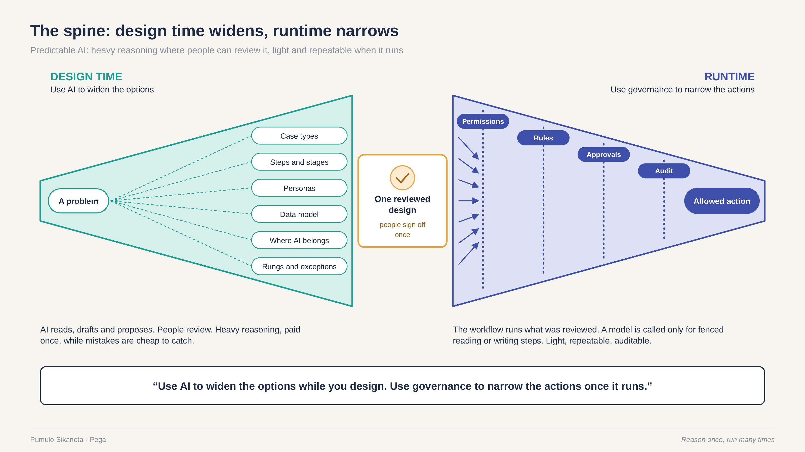
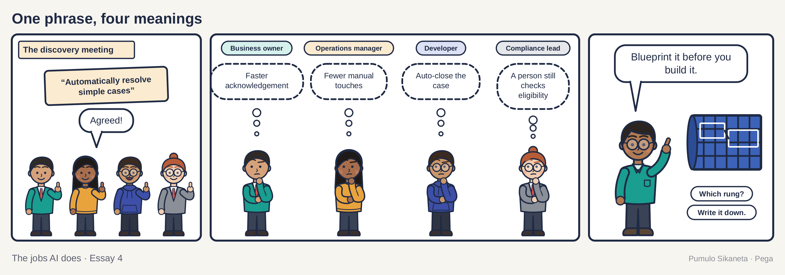
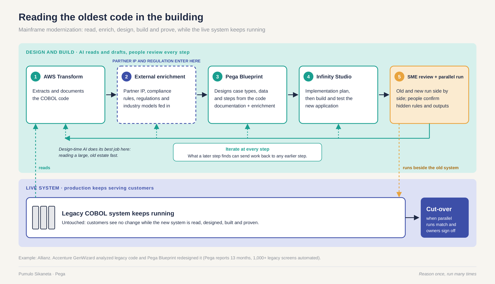

On April 4, 2020, the governor of New Jersey asked the public for help with an unusual skill. Unemployment claims in his state had gone from about 9,000 in the week ending March 14 to about 206,000 two weeks later. The system that handled those claims ran on COBOL, short for Common Business-Oriented Language, a programming language launched in 1960. Governor Phil Murphy needed people who could still read it.

"Literally, we have systems that are 40 years-plus old," he told reporters. Within days, people who knew COBOL were raising their hands to help.

It is easy to laugh at a state running on code that old. I don't. The code kept working. What ran short was people who understood it. And the code nobody understands is often the code that pays people when things go wrong.

Most banks I have worked with have a quieter version of that story. Here is one. Walter is a composite, and the details are made up, but anyone who has spent time in a bank's back office will know him.

Walter has three months until he retires. He has worked on the same system for thirty-one years. One Friday in March, a younger colleague asks him about a field in the customer record called ADJ-CD-2.

Walter looks at the screen for a while. "That's for the customers who came over in the merger," he says. "Ninety-four. Their interest got worked out differently for a few years. There might still be some."

There are. Four thousand and twelve of them. Nothing in the code says why. It says ADJ-CD-2.

The oldest code in the building is often the most important code in the building, and the people who know why it works are leaving. This last essay in the series is about the job AI does best with that code, and the part of the job it cannot do.

## Tracing the wiring while the family still lives there

Start with a house. It was built in 1958. Nobody has the original plans. Over the years someone added a kitchen, someone finished the basement, and someone ran a cable to the garage that connects to something nobody can find. The family still lives there. Dinner still has to be cooked every night.

So the electrician traces the wires before she pulls any. She turns off one breaker at a time, walks the house with a tester and writes on a strip of masking tape what each one feeds. At the end she has a map of the house as it really is, which is different from the house as anyone remembered it.

Only then does she design the new panel. For a while the old wiring and the new run side by side, until she is sure.

AI is the tester and the masking tape. It traces faster than any person and it writes everything down. The electrician still decides what goes in the new panel, and the family still eats dinner.

Readers of the [first essay](https://press.oakquant.ai/public/articles/ai-has-different-jobs) will know this place. It is the test kitchen again, with a family still eating at the table.

## A perfect score on the two questions

The first essay offered two questions for sorting any AI job. Who acts on this next? Can it be undone? Run them on mainframe modernization and watch what happens.

Who acts on this next? A person. Every document the AI writes about the old code, and every design it proposes, goes to an analyst, an architect or the expert who is about to retire. No customer sees any of it.

Can it be undone? Completely. A wrong reading of the code is a wrong paragraph in a document. You cross it out. The live system never knew.

On the six-rung ladder from that essay, the AI here informs, recommends and drafts. It never climbs past rung three. The old system keeps doing the acting, under the rules it has always had, while people study it and design what comes next. That is about as clean a design-time job as AI will ever get.

> Use AI to widen the options while you design. Use governance to narrow the actions once it runs.

## What forty years of code is like

Be kind to these systems. They are old because they work. Field names are short because storage was expensive when they were written. Comments, the notes programmers leave for each other, are missing, out of date or wrong. A rule that began as a regulation in 1987 sits next to a workaround for one branch in 1993, and the code does not say which is which. Some of the logic lives in the screens people type into. Some lives in batch jobs that run at night while everyone sleeps.

Somewhere in most of these systems there is a comment that says something like `DO NOT CHANGE. ASK BOB.` Bob retired in 1998.

Now turn it around. The mainframe is the original "reason once, run many times." Someone worked out the rules decades ago, and the machine has run them billions of times since without improvising once. The mainframe is predictable. The risk lives in replacing it.

## What AI reads well, and what it cannot know

AI is very good at the first half of the electrician's job. It can follow a value from the screen where someone types it to the file where it is stored. It can list every place a rule is used and describe the rule in plain language. It does not get bored on page nine hundred. It does not skip the batch jobs. It can turn a system nobody can explain into a document a new analyst can read in a week.

What it cannot know is why. The code says customers with ADJ-CD-2 get their interest worked out a different way. It does not say there was a merger in 1994, or that the promise to those customers may have ended in 1999, or that nobody ever turned the rule off. A model can make a good guess. A good guess about money that belongs to four thousand people is still a guess.

So the job splits cleanly. The AI reads what the code does. People decide what the business means. Each rule the AI surfaces becomes a question with a name next to it: keep it, change it or retire it. The retiring expert's time is the scarcest thing in the building. Spend all of it on those questions.

The [third essay](https://press.oakquant.ai/public/articles/the-thing-youd-notice-if-it-stopped) told the story of the Mars Climate Orbiter, lost in 1999 because one team's numbers meant pounds of force and another team's meant newtons. Old code is full of fields like that, carrying one meaning for the people who wrote them and another for the people who read them now. The same trap waits in the meeting where people design the replacement.

The kitchen ticket from the third essay is a good way to think about old code. For forty years it has been the record that kept the kitchen working, written in a hand very few people can still read. AI can read the hand. Only the kitchen can say whether the order still makes sense.

## Five steps, with a person at each one

The approach I know best runs modernization in five steps, with people reviewing each one. It is the one Pega and its partners use, and I work at Pega, so take the product names as one example of the pattern.

First, AWS Transform, the modernization service from Amazon Web Services (AWS), analyzes and documents the COBOL code. It reads the live system and leaves it alone. Second, the team adds what the code cannot say. That means partner know-how such as Accenture's assets, compliance rules, regulations and industry models. Third, Pega Blueprint uses the documentation and those extra inputs to design the case types, data and steps. Pega and AWS have worked together on this since July 2025, when they signed a five-year agreement that paired AWS Transform with Pega Blueprint for legacy modernization. Fourth, Pega's Infinity Studio turns the design into a plan, and the team builds and tests the new application. You have to build it before you can run it next to anything. Fifth, experts review it, and old and new run side by side on the same cases.

In the electrician's terms, one tool traces the wiring. Then the building code and the inspector's notes go on the table. Only then does she draft the new panel, wire it and run it beside the old one. People review every step, and any step can send the work back. A mismatch in the parallel run might send the team back to the design or the extra inputs. An expert's comment might send it back to the documentation.

One example, with its source. Allianz used Accenture's GenWizard to analyze its legacy code and Pega Blueprint to redesign the work. Pega reports that the project took 13 months and automated more than 1,000 legacy screens. Pega also reports that it cut paper by 98 percent and saves 155,000 dollars a year.

The weak spot is easy to miss in a fast project. A design generated from old code can faithfully copy a rule that should have died. Speed in the design stage can also tempt a team to shorten the parallel run, and the parallel run is where the truth comes out. So judge a modernization by two numbers. How many old rules were surfaced for a person to decide? How long did old and new run side by side before anyone switched? Those two numbers count for more than how fast the design appeared. Track both from the first week, next to the three vendor questions from the first essay.

## Where the argument thins

Here is where an experienced reader should push, and where I would push too.

AI can misread a rule. A confident, wrong explanation of old code is worse than no explanation, because it looks finished. Put the check where the output crosses the line. In this work, that line is the moment a reading becomes a design decision.

Some code encodes decisions nobody can justify any more. A rounding rule. A cut-off date. A special case for one group of customers. Copying them faithfully gives an old mistake a new home. The third essay's Robodebt story applies here in one sentence: an automated rule nobody questioned can hurt people at scale. Modernization is the rare moment when every rule gets looked at. Use it.

The human expert must sign off, and the expert should have a name. For each rule that touches money, entitlements or legal status, one person who understands the business signs for it. If that person has retired, budget the time to work the rule out again. That costs weeks. It costs less than getting it wrong for four thousand customers.

Run old and new side by side. In a parallel run, both systems process the same real cases and people compare the answers. It is slow and expensive, and it is the only proof that counts. Each difference is either a bug in the new system or a discovery about the old one. Both are worth finding before customers do.

And some mainframes should stay. They are fast, reliable and paid for. AI makes the reading cheaper. The rest of the project still has to pay for itself.

## The last day

Over four essays, this series has tried to sort the jobs AI does. The test kitchen is where it should invent. The card on the Saturday line is what the cook follows when forty tickets are on the rail. The postbox is the moment a private draft becomes a company action. The ticket is the record that keeps the kitchen honest. Old code is all of these at once: a card someone wrote forty years ago, still followed every night, by a kitchen that has forgotten who wrote it.

Here is something to do this week. Find out how old the oldest system your team depends on is. Write down the name of the person who understands it best. Then ask how many years until that person retires.

If the answer worries you, start the reading now, while the person can still check it.

Back at the house, the work is nearly done. The new panel has run beside the old one for months. Every circuit has a label, and every label has been checked by someone who lives there.

On the last day, the electrician switches off the old panel. The lights in the kitchen stay on. The family is eating dinner, and nobody looks up.

---

This is part four of The jobs AI does, a four-part series. The earlier parts are [AI has different jobs. Stop governing it like one thing.](https://press.oakquant.ai/public/articles/ai-has-different-jobs), [Shadow AI is a product problem wearing a security badge](https://press.oakquant.ai/public/articles/shadow-ai-is-a-product-problem) and [The thing you'd notice if it stopped](https://press.oakquant.ai/public/articles/the-thing-youd-notice-if-it-stopped).

## Sources

1. Pega, "Pega Signs Five-Year Strategic Collaboration Agreement with AWS to Reimagine Legacy Transformation," press release, July 14, 2025. [pega.com](https://www.pega.com/about/news/press-releases/pega-signs-five-year-strategic-collaboration-agreement-aws-reimagine)
2. Pega, Allianz customer story on Accenture GenWizard and Pega Blueprint, the source of the 13 months, 1,000-plus screens, 98 percent and 155,000 dollar figures. [pega.com](https://www.pega.com/insights/resources/blueprinting-future-how-allianz-proved-what%E2%80%99s-possible-genwizard-blueprint)
3. Ben Miller, "As Unemployment Claims Spike, New Jersey Seeks COBOL Coders," GovTech, April 7, 2020, covering Governor Murphy's April 4, 2020 remarks and New Jersey claim figures. [govtech.com](https://www.govtech.com/computing/As-Unemployment-Claims-Spike-New-Jersey-Seeks-COBOL-Coders.html)
4. CNN (Cable News Network), "Wanted: People who know a half century-old computer language so states can process unemployment claims," April 8, 2020. [cnn.com](https://edition.cnn.com/2020/04/08/business/coronavirus-cobol-programmers-new-jersey-trnd)

> **Where I stand** I am a Fellow at Pega and work on its partnership with Accenture. Both companies, and AWS, appear in this piece. The views here are my own. I used Pega as the worked example because it is the platform I know from the inside.
