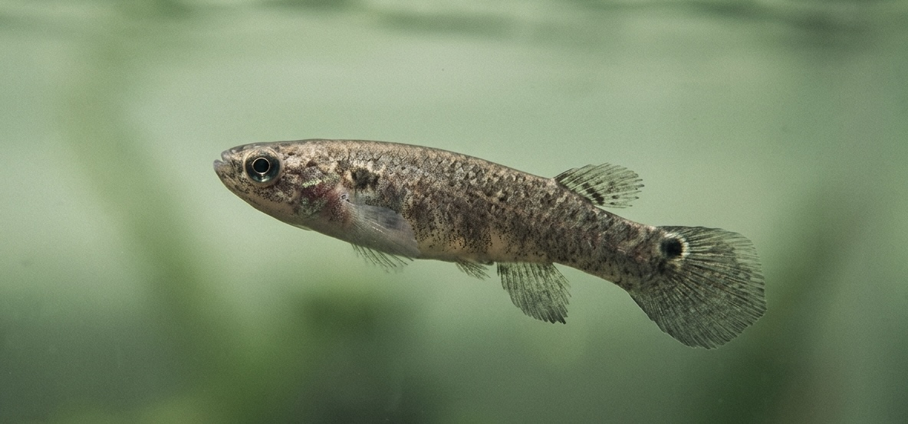

*Working title — Pumulo, this is a placeholder. Title options at the bottom of this file.*

## The fish in the quiet tank

In a lab in a small town in Nova Scotia, a fish that wants to fight is becoming a fish that doesn't.

The fish is the size of a finger. Its name is mangrove rivulus, *Kryptolebias marmoratus*, and it is one of the most belligerent vertebrates the lab world has on offer. Drop two of them in the same tank and within seconds you will see the displays, the lunges, the small precise attacks of a creature with no patience for company. The fish is also a self-fertilising hermaphrodite that produces genetic clones, which is the property that makes it interesting to people who want to know what a single variable is doing without having to argue about whether it might be the genes. In the experiment that matters here, every fish is, in effect, every other fish.

The version of the fish in this particular tank is calmer. It still does the lower-energy social displays of a fish who has noticed another fish — the head turn, the flank-on display, the small bodily acknowledgement that there is a stranger here. It just isn't trying to kill anyone. It moves around less. It conserves its energy. It is doing what tired humans call taking the temperature of the room.

The variable is a low dose of psilocybin in the water. The first author of the paper, which went up in *Frontiers in Behavioral Neuroscience* the day before yesterday, is a research associate named Dayna Forsyth. Her senior author, Suzie Currie, calls the result the first evidence in a vertebrate that the molecule can dial down escalated aggression without dialling down the social engagement underneath it. The fish does not stop being a fish. It stops being a fish that is looking for a fight.

The molecule in the water is the same molecule that appears in two hundred species of *Psilocybe* mushroom. It is the same molecule that the priests of Eleusis may have slipped into their barley beer two and a half thousand years ago, in a sanctuary outside Athens, for initiates who walked nine days without food along the Sacred Way to drink it. It is the same molecule that a psychiatrist in Sydney has, since the first of July 2023, been able to prescribe under specific conditions for treatment-resistant depression. It is the same molecule that a patient at Imperial College in London or Johns Hopkins in Baltimore now receives, on a couch, with a trained psychotherapist on either side, in a room set up to look something like a comfortable living room rather than something like a hospital.

The fish does not know it is calmer. The fish lacks the apparatus to notice. It simply is calmer, in a way that is consistent enough across replications to make a research career out of. We are the only animal that knows. Which is the trouble, and which is the gift, and which is the long subject of this piece.

What follows is a tour. We start in a snowfield in Siberia and end in a clinic in Tijuana, with stops in Athens, Cambridge, Marseille, Paris, Oxford, and a few small American towns nobody has heard of. The cast is wide. There will be reindeer behaving badly, an octopus reaching out to embrace a stranger, a Harvard philosopher inhaling laughing gas in his rooms in 1882, a German Jewish writer tracking the quality of a streetlamp in Marseille, a French intellectual on LSD in Death Valley, and a heroin addict in New Jersey in 1962 who notices, without intending to, that something extraordinary has happened.

The thread running through all of them is the same one running through Forsyth's tank. Almost everything alive, when it gets the chance, will reach for a way to be calmer. The reach is older than humans, older than language, older than the cortex that lets us name what we are doing. What is human about us is not the reach. It is everything we have built around the reach — the rituals, the laws, the philosophies, the dependencies, the recoveries — to keep the reach from killing us.

This is the story of how we have done, and not done, that.

## An anxious kingdom

There is a long-running joke among ethologists that the only animal that doesn't seek altered states is the one that hasn't been observed long enough.

Reindeer in Siberia eat *Amanita muscaria*, the iconic red mushroom with the white spots that children draw and Mario jumps on. Out in the snow, the reindeer find them, dig them out, eat them, and start behaving in the way that any creature behaves when it has eaten something its nervous system was not designed to encounter at this concentration. They wobble. They lose track of the herd. They stand still in fields and stare. Reindeer are creatures of routine, and the mushroom takes the routine away from them for a while. They appear, by the testimony of generations of Siberian herders, to seek the mushrooms out.

The herders noticed this about the reindeer, and they noticed something else. The active compounds in the mushroom — ibotenic acid and muscimol — pass through the reindeer's body largely unmetabolised. They come out in the urine. The Koryak and other Siberian peoples developed a ritual practice that takes this fact and runs with it. They drank the urine. The urine was milder, more reliable, less dangerous than the raw mushroom, which has a narrow margin between the dose that produces the visions and the dose that produces an unhappy night. The Sámi connection to all of this is contested by historians, who note that the textual evidence for Sámi shamans drinking reindeer urine on the winter solstice is thinner than the popular story suggests. The Siberian connection is not contested. People who herded reindeer for a living, in the long darkness of the subarctic winter, watched their animals get high and worked out a way to share the experience.

The list goes on, and once you start it, it is hard to stop.

Cats and nepetalactone. Catnip is in the mint family, and the molecule it produces hits a specific olfactory receptor in domestic cats that produces what behavioural ecologists carefully describe as *prosocial euphoria* and what cat owners describe by recording videos of their cat hugging a sock. About thirty per cent of cats lack the relevant receptor variant and don't respond. The other seventy per cent will, given the chance, find the catnip again.

Wallabies in Tasmania, which is the world's largest licit producer of opium poppies for the legal medical-grade morphine and codeine market, are a documented agricultural problem. They get into the fields. They eat the poppies. They go in circles. The Tasmanian government has acknowledged this, in the gentle bureaucratic prose of agriculture ministries everywhere, as a non-trivial source of crop loss. There is footage. The wallabies are not, by the look of them, suffering. They are tracing perfect rings in the poppy crop, slowly, for what an outside observer might describe as the pleasure of it.

Bighorn sheep climb cliffs that have killed members of their flock in order to reach a narcotic lichen they cannot find at lower elevations. They scrape it off the rock with their teeth, in places where one slip is the end. They keep coming back. The risk-reward calculation, in any mathematical sense, is terrible. They do it anyway.

Capuchin monkeys in South America have a habit, observed in multiple troops independently, of catching millipedes, biting them gently to release the benzoquinones the millipedes secrete defensively, and then rubbing the secretion all over their fur. The benzoquinones are insect repellent. They are also, at the doses involved, mildly intoxicating. The monkeys often appear, after a thorough rub, to be having a peaceful afternoon. They share the millipedes. They pass them around the troop. Animal behaviourists are reluctant to say that the social character of the activity is part of the point. They will say, carefully, that the activity is *highly social*, and leave the conclusion to the reader.

Dolphins have been filmed, more than once, passing pufferfish around their pod. The pufferfish, when stressed, secrete tetrodotoxin, the same neurotoxin that makes the Japanese delicacy fugu fatal at chef-error doses. The dolphins handle the puffer carefully — too much and they would die — and appear to be deliberately stressing the fish for the small dose. They float, after, in what marine biologists with their characteristic restraint have called *altered behavioural states*. The footage from the BBC's *Dolphins: Spy in the Pod* is hard to watch without anthropomorphising. The dolphins, as far as the camera can tell, are getting high.

Jaguars in the western Amazon eat the bark of the *Banisteriopsis caapi* vine. *B. caapi* is the woody component of ayahuasca, the brew that has been a sacrament for indigenous Amazonian peoples for centuries. The jaguars roll, dilate their pupils, and are quiet for hours. The local human story, told and retold in the upper Amazon, is that humans first learned about the vine by watching the cats. There is no way to verify the etymology of a sacrament. There is also no obvious reason to disbelieve it.

There is one experiment that breaks the pattern of recorded-but-uncontrolled animal behaviour into something closer to a rigorous result, and it deserves its own paragraph. In 2018, a Johns Hopkins neuroscientist named Gül Dölen — now at UC Berkeley — put California two-spot octopuses in tanks of seawater laced with low-dose MDMA. Octopuses are antisocial creatures. Drop two of them in the same tank without the drug and they will avoid each other, attack each other, or both. With the MDMA dissolved in the water and absorbed through the gills, the octopuses became, in Dölen's careful description, prosocial. They reached out. They draped themselves over the cages of the other octopuses they had been ignoring or attacking minutes before. *They tended to hug the cage*, Dölen reported, *and put their mouth parts on it*. The octopus and the human are separated by five hundred million years of evolution, and yet the molecule worked the same way on both. The receptor is older than the divergence. The reach for the company of the other animal, in the chemical state that the molecule produces, is older than the brains that have it.

The pattern in this tour is not that animals are addicts. They are not. The wallaby that ate the poppy yesterday is not, in any rigorous sense, in withdrawal today. The reindeer doesn't relapse. The use is occasional, embedded in seasons and contexts, modulated by the constraints of an animal that still has to find food and escape predators and not freeze. What the pattern shows is that the want is older than us. The desire to be temporarily other, briefly elsewhere, momentarily released from the default state of being whatever creature you are — that is not a uniquely human pathology. It is a property of being a sufficiently complicated animal in a difficult world.

Which raises the question of what humans have done with the same impulse. The answer, mostly, is that we have ritualised it.

## The long inheritance

For most of human history, in most places where humans have lived, the use of substances that alter consciousness has been a deliberate, regulated, communal act. The substance was not a recreational option. It was a sacrament. The setting was not a private apartment. It was a temple, a shrine, a circle of elders, a forest clearing where the names of the absent dead were spoken aloud. The dose was not the user's call. It was a priest's, or a curandera's, or a shaman's, and the priest had spent years learning how the dose interacted with the body, the mind, the room.

The Greeks did this for two thousand years at Eleusis, twenty kilometres west of Athens. The Eleusinian Mysteries were the most prestigious religious initiation in the ancient Mediterranean. Plato attended. Aristotle attended. Marcus Aurelius attended. Cicero said that of all the gifts Athens had given the world, none was greater than the Mysteries, because the Mysteries taught the initiates how to live with joy and how to die without fear. The initiates walked the Sacred Way for nine days, fasting. They reached the sanctuary. They drank a barley beer called the kykeon. The formula, recovered from the surviving Homeric Hymn to Demeter, is a ritual phrase the initiates were apparently required to say before drinking: *I have fasted, I have drunk the kykeon*. What happened after, every initiate was sworn never to disclose, and almost none did. We have hints. We have testimonies that what occurred inside the sanctuary at Eleusis was a vision of the structure of life and death so powerful that the initiates emerged different.

For two and a half thousand years the question of what was actually in the kykeon was an open one. The answer that increasingly looks correct is the one that R. Gordon Wasson, the American mycologist, Albert Hofmann, the Swiss chemist who synthesised LSD, and Carl Ruck, the American classicist who coined the word *entheogen*, proposed in 1978 in a book called *The Road to Eleusis*. The kykeon, they argued, contained ergot — the fungus *Claviceps purpurea*, which infects barley and produces alkaloids closely related to LSD. In 2023, archaeologists in northeastern Spain found ergot in the dental calculus of a man buried at a sanctuary devoted to the Eleusinian goddesses, and in residue inside a ceremonial vase at the same site. In February of this year, a team writing in *Scientific Reports* showed that the chemistry of converting raw ergot into a drinkable psychoactive form using the materials and methods available to ancient priestesses was straightforward — the priestesses would have had to know what they were doing, but they would not have had to know more chemistry than was already lying around the kitchen of any temple. The hypothesis is increasingly hard to argue with. The Greeks, for two and a half millennia, ran an LSD ceremony for the philosophical and political elite of the Mediterranean, and Plato wrote his philosophy after coming home from one.

The Vedic peoples of the Indus valley, around the same period, drank a substance called soma. The Rig Veda, the oldest of the Hindu scriptures, contains 114 hymns to soma. The hymns describe the substance with the directness of people who have actually drunk it: it makes the worshipper see the gods, it makes the worshipper feel deathless, it produces light in the head. What soma actually was, by the time anyone tried to write it down outside the hymns, had been forgotten. The candidates that scholars have proposed include *Amanita muscaria* — Wasson's later argument, in his 1968 book *Soma* — Syrian rue, ephedra, and a combination of the above. We will probably not know. What we know is that the most consequential set of religious texts in the South Asian world is, in significant part, written by people on a substance, about a substance, for the use of communities still trying to encounter the substance.

The Mexican highlands have an unbroken tradition that stretches from before the Aztec empire into the present day. The Aztecs called the small psilocybin mushrooms *teonanácatl*, the flesh of the gods. The Spanish, after 1521, suppressed the practice with the seriousness the Spanish reserved for what they took to be devil-worship, and the practice went underground. It survived in the mountains of Oaxaca. In 1955, a Mazatec curandera named María Sabina took part in a ceremony with R. Gordon Wasson and his wife Valentina, the first non-indigenous people to do so in living memory. Wasson published the experience in *Life* magazine in 1957. The article landed like a thrown stone in a still pool. María Sabina spent the rest of her life dealing with the consequences — the pilgrims, the disruption of her village, eventually a falling-out with the elders who held that the sacrament had been compromised by being shown to outsiders. She died in 1985, having continued to lead ceremonies, and having said, with the directness of someone who saw clearly what she had done and what it had cost: that the sacrament was no longer what it had been before the foreigners came. She did not regret showing the Wassons. She regretted that the rest of the world had followed.

In Gabon, in central Africa, the Bwiti tradition uses iboga — the root bark of *Tabernanthe iboga* — as the central sacrament of an initiatory religion that has its own theology and its own version of the thousand-year-old human practice of taking a heroic dose under supervision in order to encounter, at the limit, the structure of one's own life. Bwiti initiations involve doses of iboga that take the initiate to the edge of physical safety. People die in Bwiti ceremonies. They die rarely, but they die. The community accepts the risk because the alternative — to never have the encounter — is, by the lights of the tradition, a worse fate than to have the encounter and not survive. The tradition is as carefully held as any practice of stewardship anywhere on earth. It is held by people who, by the standards of the modern industrialised world, possess almost nothing. The thing they possess is a careful technology of altered consciousness that was old when Plato was young.

The Native American Church, formally founded in the early twentieth century but rooted in older Comanche and Kiowa peyote ceremonies, holds peyote services across the American West and into Canada. Peyote contains mescaline. The ceremonies are all-night, communal, prayer-led, and protected as a religious practice under specific exemptions to the controlled substances laws of the United States and Canada. The participants are not, in the legal or moral sense, recreational users. They are members of a continuous community of practice that has, for generations, used the substance as a vehicle for prayer.

The list lengthens if you keep going. Sufi orders in Anatolia and Persia made disputed use of cannabis. The maenads of Dionysian ritual, in the Greek world, may have used a fermented wine that included additional psychoactive plants. The early Christian Eucharist sat in a Mediterranean ritual landscape where the line between the sacred meal and the entheogenic sacrament was not as bright as the church later wanted it to be. Modern scholars argue about how much of what looks, in retrospect, like ritualised drug use was actually something else — fasting, sensory deprivation, exhaustion, group-induced trance — and the truth is probably that most cultures used a combination, and that the substance, where one was used, was embedded in the rest.

What disappears, in the modern industrialised world's relationship to these substances, is the embedding. The chemistry survives. The temple does not. The dose is taken, in most cases, in private, by an individual, with no priest, no community, no expectation of return, and no ritualised closing of the experience. Whether this matters is one of the central questions the science of the next decade is going to have to answer. There is a reason the people running the most rigorous psychedelic-therapy trials build their protocols around exactly the elements the ancient world built its rituals around: the prepared room, the trained guide, the fast, the careful integration afterward. They are not reinventing the practice. They are recovering it.

## Philosophers, with a foot in two worlds

The history of Western philosophy has a quiet sub-history that the official history mostly does not include. It is the history of philosophers who took substances, wrote about it, and let what they encountered shape their work.

It does not start with William James, but it gathers force with him.

James was a member of one of the strangest American families of the nineteenth century. His father, Henry James Sr., was a Swedenborgian theologian of independent means who took his children on grand tours and put them in and out of European schools to develop their souls. His brother Henry Jr. became the novelist. His sister Alice became a diarist whose private chronicle of her chronic illness is one of the great records of consciousness in pain. William was the eldest. He trained as a doctor, a chemist, a painter, and finally as a psychologist. He took a position at Harvard in 1873 and held one variation of it for the next thirty-five years. He had also, since his late twenties, suffered from a depression severe enough that he wrote in his journal about whether to continue living, and decided, in a famous private moment, that he would treat his decision to continue as itself an act of faith — he would believe in his own free will because believing in it might be the thing that saved him.

In 1882, James read a pamphlet by an upstate New York mystic named Benjamin Paul Blood, who had got high on nitrous oxide at the dentist's office and decided that the experience contained the key to philosophy. Blood's pamphlet was called *The Anaesthetic Revelation and the Gist of Philosophy*. James, characteristically, decided to find out for himself. He inhaled the gas in his rooms in Cambridge, Massachusetts. He inhaled it more than once. He wrote about the experience that same year, in an essay in *Mind* called *On Some Hegelisms*, and again later in *The Varieties of Religious Experience*.

What James found, under the gas, was a sense of overwhelming reconciliation. The contradictions he had been arguing about as a philosopher dissolved. The line between himself and the things outside himself softened. The conviction, while it lasted, was that *truth lies open to the view in depth beneath depth* — that philosophy, in its normal sober condition, was a person trying to read the foundation of a building by examining the wallpaper. The conviction did not survive the gas wearing off. The notes James scribbled to himself while high read, sober, like the babbling of a man who had momentarily lost the use of his mind. But the *sense* of having been somewhere, of having seen the building, persisted. James did not decide, as a sceptic might have, that the sense was illusory. He decided that it was data — data about the topology of consciousness, data about the existence of states our normal waking minds could not reach without help. Our normal waking consciousness, he concluded, was *but one special type of consciousness*, and other forms lay parted from it by the filmiest of screens. The molecule had shown him the screen.

The Varieties of Religious Experience, which James gave as the Gifford Lectures in 1901–1902 and published in 1902, is one of the most important books in the history of the philosophy of religion. It would not exist, in the form it exists, without the gas. James was a depressive who had glimpsed, while breathing nitrous oxide in 1882, that there was somewhere else to be than the bottom of his own depression. He spent the next twenty years arguing that the somewhere else was real, was philosophically respectable, and was something philosophy had no right to ignore.

## Walter Benjamin in Marseille

Walter Benjamin was a German Jewish writer who, between roughly 1924 and his suicide in 1940, produced some of the most original prose written in any European language in the twentieth century. He never held a permanent academic post. He was financially supported, sporadically, by his friend Theodor Adorno and the Frankfurt School. He was separated from his wife. He saw his son rarely. He moved between Berlin, Paris, Capri, and a variety of cheap hotels and borrowed apartments, writing his enormous unfinished study of nineteenth-century Paris — *The Arcades Project* — and short essays for whatever journal would take them.

In the late 1920s and into the 1930s, Benjamin took hashish on a number of carefully recorded occasions. The records are collected in a notebook he labelled the *Hashish Protocols*. He took the drug with friends, in their apartments, often with one of them as the sober observer. The protocols are not the testimonies of a recreational user. They are the field notes of a man trying to find out what happens to perception, attention, and the experience of meaning when the ordinary working of the mind is loosened.

What the protocols show is a writer who, under hashish, became unusually attentive to the texture of small things. The streetlamps of Marseille belonged to him for the duration of an evening. The sound of a bell unfolded in slow motion as it decayed. Faces, in the cafés, became readable in a way they had not been before. He wrote one of his most beautiful short essays, *Hashish in Marseille*, out of one of these evenings. The essay is not about being high. It is about how the city, on that one evening, came briefly into focus.

Benjamin was a man under tremendous pressure. He was running, during the years of the protocols, from the German fascism that would, in 1940, kill him at the Catalan border, when he took an overdose of morphine in a hotel in Portbou rather than be turned over to the Gestapo. He was also a man for whom most of the ordinary supports of a settled life — money, a permanent home, family proximity, professional standing — had failed. The hashish gave him a few hours, several times a year, when the city itself became kind to him. The protocols suggest he understood what the substance was doing for him. He did not romanticise it. He did not depend on it. He used it as a window, a few times, into a relationship with the world that the ordinary working of his mind could not, on its own, sustain.

He killed himself at forty-eight. The hashish had not saved him. But for a few hours at a time, in the years before, it had been on his side.

## The mescaline garden

Aldous Huxley first took mescaline on a May morning in 1953, in the garden of his house in the hills above Los Angeles. He was fifty-eight. He had been nearly blind since adolescence, the result of a corneal infection that had left him reading with a magnifying glass for most of his adult life. The doctor on hand for the mescaline experiment was a young Canadian psychiatrist named Humphry Osmond — the man who would, two years later, coin the word *psychedelic* in a letter to Huxley, after the two of them had spent some time trying to find a less laden term than the alternatives on offer.

What happened to Huxley in his garden became the book *The Doors of Perception*, published in 1954. The book is, despite its reputation, mostly about flowers. The mescaline gave Huxley a few hours of what he described as *seeing*, in the strong sense — a chair was a chair as a chair actually was, an iris was an iris, the folds in his trousers were a landscape in their own right. The book is a careful piece of writing by a man who had spent his life thinking about religion, mysticism, perception, and the moral life of the rich Western intellectual, and who suddenly had access, for an afternoon, to the kind of perception he had only previously been able to read about in mystical literature.

Huxley spent the rest of his life working through what the encounter had given him. He took mescaline again, sparingly. He took LSD, sparingly. He wrote a sequel — *Heaven and Hell*, in 1956 — that was tougher, more aware of the dark side of the same encounter. He died of cancer in November 1963, on the same day John F. Kennedy was assassinated, which is the reason most Americans alive in 1963 do not remember that Huxley died that day. On his deathbed, lucid, he asked his wife Laura to inject him with LSD. She did. He died a few hours later. It is not a recommendation. It is not a moral. It is the death scene of a writer who had spent ten years thinking about what altered consciousness was good for, and had decided that one of the things it was good for was being awake at the end.

## Foucault at Zabriskie Point

In the spring of 1975, Michel Foucault — already the most influential French philosopher of his generation, lecturing at the Collège de France, mid-way through *The History of Sexuality* — flew to California for a visit organised by a young academic named Simeon Wade, who was teaching at Claremont. Wade and his partner Michael Stoneman drove Foucault out to Death Valley. At Zabriskie Point, near sundown, they gave him LSD.

Foucault had not, until that night, taken a major psychedelic. He came down hours later sitting on the ground, watching the sky, and weeping.

He returned to Paris a different writer. The volumes of *The History of Sexuality* that he produced in the years afterward — particularly the second and third — are visibly different in shape from what he had been writing before. The work becomes more interested in techniques of the self, in the ancient practice of *care* of the self, in what an ethics of existence would look like if you had, in fact, looked at the categories you were working inside and seen that they were not the only categories. Foucault wrote to Wade afterwards. Wade kept the letters. Wade also, decades later, published a small book called *Foucault in California* about that night, in which Foucault was reported to have said something close to: *the experience changed my life*. We have only Wade's account. Wade was in love with Foucault, and the account has the protective glow of a chronicler who saw what he wanted to see. But the books that Foucault wrote after Death Valley are real, are visibly different from the books before, and were written by a man who had, in the desert of California in his fortieth year, seen something he had not seen before.

## Freud and the wonder drug

It is impossible to write about philosophers and substances without writing about the specific case of Sigmund Freud, because the specific case of Sigmund Freud is the warning that has to sit alongside the rest.

Freud, in the early 1880s, was a young Viennese neurologist with a brilliant career in front of him, an unhappy bank balance, and a personal hero in the form of Ernst Fleischl von Marxow, a slightly older physiologist who had become a close friend. Fleischl had, years earlier, lost a thumb to a laboratory accident, and had become addicted to morphine in the course of treating the chronic pain that followed. He was a brilliant man being slowly destroyed by an opioid he could not stop using. Freud, who had read about a new alkaloid extracted from coca leaves, decided to try it on himself. He liked it. He gave it to Fleischl. He published a paper in 1884 — *Über Coca* — recommending cocaine for, among other things, depression, digestive disorders, asthma, and the treatment of morphine addiction.

Cocaine did not cure Fleischl's morphine addiction. It added a cocaine addiction on top of the morphine one. Fleischl became, over the following years, a man in steady psychotic decline, hallucinating insects under his skin, suffering from what we would now call tactile hallucinations of formication, and dying, at forty-five, after years of suffering Freud witnessed at close range. Freud, to his credit, did not pretend it had not happened. His published enthusiasm for cocaine dropped off sharply after Fleischl's death. He continued to use the drug occasionally for some years, never recovered the early uncritical excitement, and lived the next four decades aware that the most public scientific claim of his early career had contributed to the destruction of his closest friend.

There are two moves, in the standard biographies, that try to soften this. One is to say that Freud was a man of his time, and that the limits of nineteenth-century pharmacology made the error reasonable. The other is to say that the mistake was small and that the rest of Freud's life redeemed it. Both moves understate what happened. *Über Coca* is a careful, well-written, professionally argued case for a substance the author wanted to be a wonder drug. The pressure on Freud was the pressure of a young man who needed the drug to be what he hoped it was — for his career, for his bank account, for his friend. He saw what he wanted to see. He recommended it confidently. Fleischl, whose pain had been real, took the recommendation. The arc of *Über Coca* is the cleanest demonstration in the medical literature of the nineteenth century of how badly a brilliant person can be wrong about a substance because they have a stake in being right.

The lesson does not invalidate any of the careful, communal, ritualised use that the Greeks at Eleusis or the Mazatec curanderas of Oaxaca or the Bwiti of Gabon have practised for millennia. The lesson is more specific. It is about what happens when an individual, working without the surrounding apparatus of community and ritual, in the grip of personal need and professional ambition, decides on his own that a substance is safe. The grip warps the seeing. The seeing produces the recommendation. The recommendation costs.

## Coleridge, and the price of the dream

Samuel Taylor Coleridge composed *Kubla Khan*, by his own account, in the summer of 1797, after taking opium for a stomach complaint at a remote farmhouse on the Devonshire coast. He fell asleep with his copy of *Purchas his Pilgrimage* open to a passage about Kublai Khan's pleasure dome at Xanadu. He woke. He believed he had composed two or three hundred lines of poetry in his sleep. He sat down to write them out. He was interrupted, he later said, by a person on business from Porlock — a small village a few miles away — who detained him for an hour, and when Coleridge returned to the page the rest of the poem was gone. The fifty-four lines that survive are some of the most famous in the English language. The Person from Porlock has become a byword for any interruption that costs a creative person a finished work.

The story is too neat to be perfectly true and too suggestive to be entirely false. What is documented, beyond doubt, is that Coleridge spent the rest of his life — from his late twenties to his death in 1834 at sixty-one — in increasing dependence on laudanum, the alcoholic tincture of opium that was, in nineteenth-century England, sold over the counter at any apothecary. He took it for chronic pain. He took it for melancholy. He took it because he had become a person who could not, after a certain point, stop taking it. He continued to write — *The Rime of the Ancient Mariner*, the *Biographia Literaria*, lectures, criticism — but the second half of his life was, by his own confession, a long unfinished argument with the substance that had given him his most luminous early work and was now slowly erasing his ability to finish anything.

He wrote, in private letters, about the addiction with the clarity of a man who saw exactly what was happening and could not get out. The letters are some of the most painful documents in the history of English literature. Coleridge knew. Coleridge was not deceived. The drug had given him *Kubla Khan*, which he could not have written without it. The drug had also, by his fortieth year, made it impossible for him to write anything that long again without help. The arc of his life, from the dream at the Devonshire farmhouse to the long laudanum afternoons in his last decades at the Highgate house of his physician James Gillman, is the arc the modern world keeps relearning. The substance that opens the door also, on the way back through, can keep you from leaving.

## A cluster of others, briefly

The list of philosophers, scientists, artists, and writers whose work has been visibly shaped by their use of substances is long, and only a partial roll is needed to make the point.

Jean-Paul Sartre took mescaline once, in 1935, under the supervision of a friend who was a psychiatrist. He spent the next several months convinced he was being followed by giant lobsters. He wrote about the lobsters, eventually, in his essay on Tintoretto and in scattered references throughout the early novels. He got the lobsters under control, more or less, by the late 1930s. He never took mescaline again.

Carl Sagan was a regular cannabis user from his thirties until his death. In 1971, anonymously, under the pen name *Mr. X*, he contributed an essay to Lester Grinspoon's book *Marihuana Reconsidered*, in which he described what he believed cannabis did for his thinking. His authorship was confirmed posthumously. Sagan thought the substance helped him see across categories he otherwise kept separate, and that some of the connections he had made in his most important work would not have come to him without it. He signed the essay Mr. X because, in 1971, signing it Carl Sagan would have been the end of his career.

Paul Erdős, the Hungarian mathematician who collaborated on more papers than any other mathematician in history, took amphetamines for decades. In 1979 his friend Ronald Graham bet him five hundred dollars he could not stop for a month. Erdős won the bet. He took the money, and told Graham that mathematics had been set back a month. He went back on. He produced more theorems than almost any human in the history of his discipline.

These are not endorsements. The piece is not an endorsement. They are testimonies that the substances have been part of the intellectual life of the modern West more fully and continuously than the official cultural record acknowledges, and that the people who used them most consequentially were not, mostly, people with anything to gain by lying. James was an established academic before he tried the gas. Huxley was Huxley. Freud was Freud. Coleridge died telling the truth about what had happened to him. The testimonies are mixed. Some are warnings. Some are wonders. The honest answer is that most of them are both.

## What is actually happening

The chemistry of all of this turns out to be, in its outline, simpler than the cultural complexity around it would suggest. Most of the substances the piece has been discussing — psilocybin, LSD, mescaline, DMT — work on the same target. They are agonists at the serotonin 2A receptor, a particular site on a particular kind of neuron in the cortex. When they bind there, the neurons fire in patterns they don't normally fire in. Imaging studies done over the past fifteen years, principally at Imperial College in London under the neuroscientist Robin Carhart-Harris, have shown that this firing pattern corresponds to a quieting of what is called the Default Mode Network — the constellation of brain regions that handles self-referential thought, the inner narrator, the constant background sense of being a person doing things.

The Default Mode Network is the part of the brain that, when you are not actively engaged in a task, runs the long argument with yourself. It rehearses the thing you should have said. It plans tomorrow. It worries about the future. It tells you what kind of person you are. It is, in non-clinical terms, the source of the ordinary ego — the ongoing sense of being a coherent self moving through time. It is also, in clinical terms, hyperactive in depression. The depressed brain, on imaging, has a Default Mode Network turned up too loud. The patient cannot stop the inner argument.

What psychedelics appear to do, at the level of network behaviour, is turn the volume down on this. The inner narrator, briefly, stops talking. What James called the dissolution of the line between *meum* and *tuum* is the experience, from the inside, of the network being briefly offline. The Eleusinian initiates' loosening of fear was the same network, going quiet, in a sanctuary outside Athens. Huxley's iris in his garden was the same network. The mangrove rivulus that has stopped attacking is, in the limit of what fish brains do at all, an analogous quieting.

Ketamine works on a different receptor — it is an antagonist at the NMDA receptor — and produces a different experience, more dissociative, with the patient often reporting a feeling of being separated from their body rather than of merging with the world. But the downstream effect on the Default Mode Network appears similar. The inner narrator pauses. The patient comes out of a session with the depression noticeably lifted, sometimes for days, sometimes longer.

The neuroplasticity story is the most interesting recent finding and the one the next decade of clinical work is likely to centre on. Both classes of substance — the serotonergic psychedelics and the dissociatives like ketamine — appear to produce, for hours to days after a session, a state of increased dendritic growth in the brain. The neurons grow new connections. The brain, in a literal physical sense, becomes briefly more flexible. The window during which this happens is sometimes called, by the scientists who work on it, a *critical period* — a temporary state of the kind a child's brain is in for years on end. The therapeutic logic of psychedelic-assisted therapy is built around this window. The session is the chemistry. The integration afterwards — the days and weeks of careful work with a therapist — is the use of the window to move the patient out of patterns they have been stuck in, sometimes for decades.

The opioid story is the dark mirror of all of this. Opioids — heroin, morphine, oxycodone, fentanyl — work at a third receptor, the mu-opioid receptor. Activation produces analgesia, the relief from pain. It also produces euphoria, which is the part the brain wants more of. Repeated activation produces tolerance — the same dose stops doing the same thing — and dependence — the body's normal pain regulation system has been remodelled around the presence of the drug, and the absence of the drug becomes its own kind of pain. The reward system, under repeated activation, eventually stops responding well to anything. The food is less good. The walk is less good. The conversation is less good. The drug is, by then, the only thing left that produces reward at the old level. This is the architecture of opioid dependence in three sentences. It is not a moral failing. It is a receptor doing what receptors do, in a body that has been asked to do something receptors are not built to do well.

The line between the substances that heal and the substances that trap is not a moral line. It is a pharmacological one. Substances that produce strong, fast, repeatable activation of the reward pathway — the mu-opioid receptor especially, but also the nicotinic system and the dopamine system — can become traps. Substances that work primarily on the serotonin 2A receptor or the NMDA receptor, on their own, generally do not. Psilocybin is not a substance one becomes physiologically dependent on. The body does not go into withdrawal from the absence of psilocybin. The brain, on serotonergic psychedelics, does not develop the same kind of tolerance-then-dependence cycle that is the signature of opioids. This is one of the reasons the careful, supervised, occasional use of the serotonergic psychedelics is being seriously investigated as a clinical tool, while no one is seriously investigating the careful, supervised, occasional use of fentanyl as a treatment for depression.

The chemistry, in other words, partly answers the moral question. Not entirely. There is no substance free of risk. The serotonergic psychedelics carry their own dangers — particularly for people with a personal or family history of psychotic disorders, where the temporary loosening of the network can become a permanent loosening that does not heal. The ibogaine of the Bwiti, used for thousands of years in Africa, has a real cardiac risk profile that has killed people in unsupervised settings, and that any responsible clinical use has to engineer carefully around. The stories that go right go right because the people involved — the priest, the curandera, the doctor, the patient — knew what they were doing. The stories that go wrong go wrong, almost always, because the people involved did not.

## The shadow

The opioid story in the United States and Canada over the last twenty-five years is the cleanest large-scale demonstration in the modern world of what happens when a substance with strong reward-pathway activation is released into a population without the surrounding apparatus of careful, communal, ritualised use.

The numbers are familiar at this point and worth restating in plain language because the familiarity has dulled them. Roughly six hundred thousand people died of opioid overdoses globally in 2024. The American share of that — driven primarily by fentanyl, an opioid synthesised originally for surgical anaesthesia and now produced in clandestine labs at a fraction of the cost of heroin — was around eighty thousand. That is more Americans, in a single year, than died in the entirety of the Vietnam War. The Canadian share, on a per capita basis, is comparable. The British and Australian shares, while smaller, are climbing. The European continent, which for most of the past quarter-century had been spared the worst of the synthetic opioid crisis, has begun to see fentanyl in its drug supply for the first time at scale.

The story of how this happened — Purdue Pharma, the Sackler family, the marketing of OxyContin in the late 1990s as a long-acting opioid that did not produce dependence, the gradual realisation across the 2000s that it absolutely did, the lawsuits, the bankruptcy, the overdose curves climbing as legitimate prescription opioids became harder to obtain and patients turned to heroin and then to fentanyl — has been told at book length more times than I can usefully cite here. Patrick Radden Keefe's *Empire of Pain* is the best of the recent treatments, and the Hulu series *Dopesick* is the most accessible. The pattern in all the tellings is the same. A substance with strong reward-pathway activation was released into a population by a corporation that knew what it was doing. The corporation was wrong, fatally for hundreds of thousands of people, in the same way Freud was wrong about cocaine — except that Freud was a young doctor with a sick friend and the Sacklers were a billionaire family with a marketing department. The error scales with the resources behind it.

What addiction is, at the level of the lived experience, has been written about by people who have lived it more clearly than someone who hasn't can render. Ann Marlowe's *How to Stop Time*, on heroin. William S. Burroughs' *Junky*, on the same. Mary Karr's *Lit*, on alcohol. Caroline Knapp's *Drinking: A Love Story*, on alcohol. Leslie Jamison's *The Recovering*, on alcohol again, with the long backward look at the literature of recovery. Maia Szalavitz's *Unbroken Brain*, on the science of addiction by a writer who spent her twenties addicted to heroin and cocaine. The shape, across the testimonies, is consistent. The substance starts as a relief, becomes a pleasure, becomes the only thing that produces pleasure, becomes the thing the absence of which is unbearable, becomes the centre around which the rest of the life is reorganised, until the life is a life lived around the substance and almost nothing else.

Coleridge, two hundred years ago, knew. The testimonies of the modern writers track, with a precision that should chasten anyone who thinks the science is new, what Coleridge wrote in his letters from Highgate. The drug that opens the door can also keep you from leaving. The opening is real. The trap is real. They are sometimes, for some substances, the same chemistry. Knowing this is not a moral judgement on anyone caught in it. It is a description.

The moral judgement that does land, when it lands, lands on the people who, knowing this, made the substances available without the surrounding apparatus. The Sacklers. The corporate lawyers. The doctors who took the marketing calls and wrote the prescriptions because the marketing said it was safe. The sociologically ordinary failure modes of large-scale modern systems, applied to a class of substance that those systems were not equipped to handle responsibly. The error was not, mostly, the user. The error was the architecture.

## The healing turn

In 1962, in Manhattan, a nineteen-year-old heroin addict named Howard Lotsof, who had been using for several years, took a substance he had read about somewhere — an obscure West African plant alkaloid called ibogaine — out of curiosity, expecting another high. The trip was thirty-six hours long. It was visually intense, exhausting, and not pleasant in the way a recreational user looks for. When it was over, Lotsof noticed something strange. His heroin craving was gone.

It stayed gone. He went, by his own account, days, then weeks, without using, with none of the physical or psychological withdrawal that should have, by every existing model of opioid dependence, been making his life unliveable. He was not, suddenly, somebody who had never used heroin. The memory of the use was still there, the knowledge of where to score, the people, the rituals. What was missing was the wanting. The internal pressure that had organised his life around the next dose was simply not there.

Lotsof was not a scientist. He was a curious, intelligent young man who had stumbled into a discovery that, fifty years later, the most rigorous addiction research in the world is now spending serious money to understand. He spent the rest of his life — he died in 2010 — trying to get the medical world to take ibogaine seriously. For most of the second half of the twentieth century, the medical world did not. The substance was federally illegal in the United States. It carried real cardiac risks — ibogaine can produce QT prolongation and, at the doses needed for the addiction effect, has caused a small but non-zero number of deaths. The clinical research apparatus of the late twentieth century was not set up to develop a politically illegal molecule with a non-trivial safety profile, regardless of what the molecule could do. The research went underground, into clinics in Mexico and Tijuana and the Caribbean and New Zealand, run by people of varying credentials, treating patients who had nowhere else to go.

What has changed in the last five years is that the research has come back above ground. Stanford has now run a Phase II trial — the MISTIC study, led by the psychiatrist Nolan Williams — on ibogaine for treatment-resistant opioid use disorder. The early results, published in January, reported abstinence rates at six-month follow-up dramatically higher than what conventional medication-assisted treatment achieves. The numbers should be read with the appropriate caveats — the population was small, the trial was unblinded for ethical and practical reasons, and the long-term durability of the effect at one year, two years, five years is not yet known. But the result is the result. A substance that produces, in a single thirty-six-hour session, a months-long absence of opioid craving is, if it holds up under further trial, a thing the world has not previously had. Texas allocated fifty million dollars in 2025 to ibogaine research, on the basis that if the substance does work the way the early data says it does, the cost of getting it through the FDA and into supervised clinical use is small compared with the cost of the eighty thousand annual American overdose deaths.

The ibogaine work sits inside a wider movement. Australia, on the first of July 2023, became the first country in the world to formally permit the prescribing of psilocybin for treatment-resistant depression and MDMA for post-traumatic stress disorder — under tight controls, by specifically authorised psychiatrists, but real and legal. The American picture is more complicated. Lykos Therapeutics, the corporate descendant of the non-profit MAPS that ran the original MDMA-for-PTSD trials, applied to the FDA in 2023 for approval. The FDA rejected the application in June 2024, citing concerns about the trial design and the difficulty of doing a proper double-blind on a substance whose effects are obvious to the patient and the therapist within minutes. The rejection was a setback. It was not, in the longer view, a stopping. Compass Pathways and a number of smaller research outfits are continuing the psilocybin work. Imperial College in London has been running careful clinical trials of psilocybin for depression for over a decade, under Carhart-Harris and now David Nutt and Meg Spriggs. Johns Hopkins, where the modern American psychedelic research programme was rebuilt from scratch under Roland Griffiths in the 2000s, is continuing — though Griffiths himself died of pancreatic cancer in 2023, having spent his last months giving interviews about what the work had meant to him. Oregon and Colorado have, by ballot initiative, established frameworks for supervised psilocybin services that operate outside the traditional medical model. The landscape is patchy, contested, and moving.

The therapeutic logic across the work is consistent. The session is large. The dose is meaningful. The setting is carefully prepared — the room, the music, the trained guide. The work afterwards — the integration sessions, the writing, the group discussions, the days of coming back to ordinary life with the new material — is where the durable change happens, if it happens. The model is closer to surgery than to a daily medication. One session, well done, can do work that ten years of an SSRI cannot. One session, badly done, can also produce a casualty. The skill of the people running the sessions is, by every account from the patients, the variable that matters most.

The most important fact about the healing turn, for the reader, is that it is not a panacea. It is not the answer to everyone's depression. It is not a substitute for therapy, for medication, for the slow work of changing a life. The trials that have produced the most striking results have been on populations of patients who had failed multiple other interventions — patients for whom the alternative was either continued suffering at the same level or, in too many cases, suicide. The substances are real. The risks are real. The work is real. The combination, done carefully, by people who know what they are doing, can produce results that the previous generation of psychiatry would have called miraculous. The combination, done badly, by people who don't, can hurt people.

The pattern, you will notice, is the pattern that the priests of Eleusis already knew. The chemistry alone is not the medicine. The chemistry plus the room plus the guide plus the integration is the medicine. The Greeks worked this out two and a half thousand years ago. The modern world, having spent a century pretending the chemistry was either evil or magic, is finally rebuilding the rest of the apparatus around it.

## The quiet animal

The fish in the tank in Nova Scotia does not know it is calmer. The reindeer in the Siberian snowfield does not know it is high. The wallaby in the Tasmanian poppy field is, as far as anyone can tell, not running an internal commentary on its experience of running in circles. The capuchin monkey rubbing its fur with the millipede secretions is not, in any sense we can verify, asking itself why it does this. The animals do what the animals do. Whatever the reach toward the substance is for them — relief, novelty, defence, social bonding, simple pleasure — it is a reach without a narrator.

The narrator is what we have, and the narrator is the trouble.

The narrator is the part of the human animal that asks, after the experience, what the experience meant. The narrator is what the priests at Eleusis built their ritual around. The narrator is what William James wrote his philosophy from. The narrator is what Coleridge could not, in his last decades, get free of. The narrator is what the Default Mode Network produces, and what the substances quiet for a few hours, and what comes back online, sometimes changed and sometimes not, when the substances wear off. The narrator is also, in the cases that go wrong, the part that learns to want the chemical it has been quieted by, until the wanting is the whole story.

The animal under all of that — the animal that was in Forsyth's tank, the animal that is in every reader of this piece — is older than the narrator. It wants what the fish wants. It wants to be, briefly, less of a thing that is fighting. It wants the conserved energy, the lower-cost engagement, the small social signals without the expensive attacks. It has wanted this since before there was language to name the wanting. It will want it after.

What the long human history of substances shows, at its best, is that the wanting can be honoured. There is nothing wrong with it. The reindeer wants it. The octopus, given the molecule, will reach out and embrace a stranger. The Greek philosopher walked nine days to drink it. The depressed Harvard professor breathed it through a rubber mask in his Cambridge rooms. The patient on the couch at Imperial today swallows it from a small ceramic cup with a trained therapist on either side. The wanting is consistent. What changes is the apparatus.

What the long human history of substances shows, at its worst, is what happens when the apparatus is missing. The corporate marketing of an opioid into a population without the surrounding ritual or the careful priest. The lone user with no community, no integration, no return. The arc of *Über Coca* and the arc of OxyContin, the arc of Coleridge's last decades and the arc of Fleischl's hallucinated insects, are all the same arc. A real reach for a real relief, met by a substance that delivered the relief and, in the absence of the surrounding apparatus that older cultures would have built around it, took the rest of the life with it.

The fish in the tank cannot help us with any of this. The fish has not asked to be a metaphor. The fish was just calmer that afternoon, in a way that meant a careful research associate could publish a paper. But the result is genuinely strange and worth ending on. The molecule that was in the water was the same molecule that was in the kykeon at Eleusis, the same molecule the Mazatec curandera drank in 1955 with the American banker who would tell the world. It worked on the fish the same way it worked on the philosopher. It did not loosen the fish from its narrator, because the fish has no narrator to loosen. It just dialled down the cost of being a fish in a tank with another fish.

We are the only animal who knows. We are the only animal who can write the paper. We are also the only animal who can build the temple, the trial, the integration session, the careful five-thousand-year tradition of using the chemistry well — and the only animal who can build the marketing department, the paper mill, the cheap synthetic, the fentanyl supply chain, and turn the wanting against ourselves.

Almost everything alive wants to be calmer. What is human about us is what we do with the wanting. The reach is universal. The apparatus is what we build. We have built, in our long history, both the best and the worst of the apparatuses any animal has ever built around any chemistry. We are still building. The fish, mercifully for the fish, does not have to.

Pumulo Sikaneta

---
