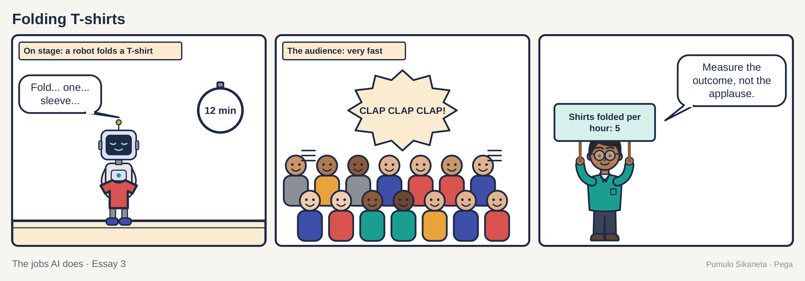
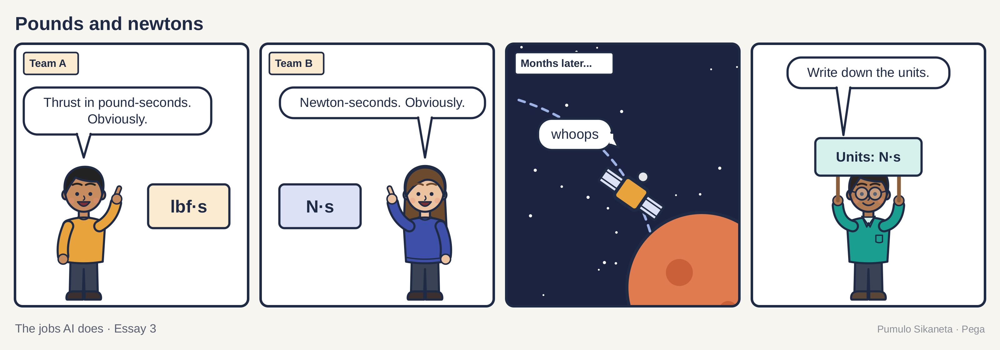
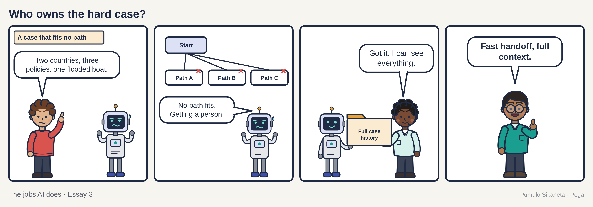
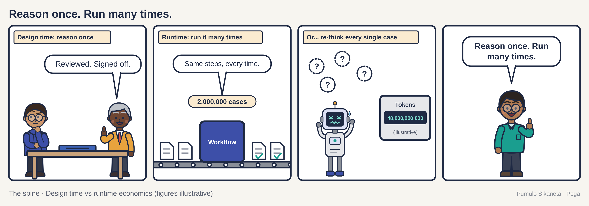

A woman sits in a registrar's office with her father's death certificate in a brown envelope on her lap. The registrar asks if she would like to use Tell Us Once. She says yes without really knowing what it is.

She has been dreading the phone calls. Last night she made a list on the back of a gas bill. Pensions. Tax. His driver's license. His passport. The council. Five calls, five hold queues, five strangers, and five times saying the sentence she still cannot say without her voice going strange.

She says it once, in one office, and the offices that need to know are told.

She does not think about the system at all. That is the point of it.

She is a composite. The service is real. The UK government runs Tell Us Once. When someone registers a death, the registrar can pass the news to several government departments and the local council in one step, so the family does not have to phone each office and explain again.

I think about her when people ask me what AI is for. In my novel Someone To Look Up To, a character describes the quiet, repeated work that holds a life together as "the thing you'd notice if it stopped." I wrote that line about a person. I have come to think it also describes good infrastructure. The most valuable AI in many organizations will look like that woman's afternoon: a story that only had to be told once.

## The applause problem

The public picture of AI is loud. Robots. Benchmarks. Coding agents that build an app overnight. A race between countries. All of that is real, and some of it is astonishing.

Conference keynotes now feature humanoid robots folding T-shirts on stage. The folding is slow. The applause is very fast.

I like the robots. I would like one for my laundry. Most companies, though, will feel the value of AI first somewhere much quieter: in the case that stays found, the customer who says a thing once, the record that lets someone explain later what happened and why. The excitement is earned. The measuring stick is wrong. If you measure AI by how it looks on stage, you will build things that look good on stage.

## Five jobs in one sentence

Take one boring request. A customer calls her bank and says, "I've moved." It takes her three seconds. Inside that sentence are five jobs.

1. Confirm she is who she says she is.
2. Find every system that holds the old address. In a large bank, that can be a surprising number.
3. Check whether different tax rules now apply.
4. Tell the people who send letters and cards.
5. Stay alert, because changing the address is one of the first moves a fraudster makes when taking over someone's account.

Get one of those wrong and the new card goes to the old house. The new owners seem nice. They now have a credit card with your name on it and a decision to make about what kind of people they are.

Boring and unimportant are different things. NASA learned this in 1999. On September 23 of that year, the Mars Climate Orbiter flew too close to Mars and was lost. One team's software produced thrust figures in pounds of force. Another team's software expected newtons. The numbers passed between them with nobody noticing the mismatch. The whole mission cost about 327.6 million dollars. It was lost to a label on a number.

Nobody gives a keynote about units. Every working system depends on them.

## The waiter and the ticket

In the [first essay in this series](https://press.oakquant.ai/public/articles/ai-has-different-jobs) I used a restaurant kitchen. Here it is again.

A charming waiter who never writes anything down is lovely until your order arrives wrong. The ticket on the rail is what makes the kitchen work. It says what was ordered, by which table, at what time, and whether anyone flagged an allergy.

The waiter is a system of conversation. The ticket is a system of record. Both matter. Chat assistants are very good waiters: friendly, quick and never tired of questions. A company still needs the ticket. It needs one place that says what is true, what is allowed, who is accountable, what happens next and what happened last time. That record is what lets a customer stop repeating herself. Without it, every conversation starts from zero, however charming the waiter.

Try explaining this to a child. The conversation might go like this.

"What does the AI at your work do?"

"It makes sure the right message reaches the right person, and nobody has to explain things twice."

"So it's a postman."

"Exactly like a postman. A postman who remembers every house on the street and every letter he ever carried."

The child wins that round. Most of the useful AI I see inside large organizations is a very good postman with a very good memory.

## Where people belong

Generative AI is at its best where things are messy and need reading or writing: a scanned letter, a long case history, an angry email that someone needs to understand. Rules and workflows are at their best where a company needs the same right answer every time, plus a record of why. Responsible AI means choosing the right mode for each step, instead of putting a model in charge of all of them.

Then comes the question of where people belong. I want to be exact. The aim is to put people where they matter most, and there are three such places: the unclear case, the moment that needs kindness, and the decision someone must answer for. Plenty of human touches can go. Nobody will miss retyping an address into a fourth system. Those three should stay.

Klarna gives a clean before and after. On February 27, 2024, Klarna said its AI assistant was doing "the equivalent work of 700 full-time agents." In May 2025, its chief executive, Sebastian Siemiatkowski, told Bloomberg that cost had been "a too predominant evaluation factor," and that "what you end up having is lower quality." The company started hiring people again.

Efficiency is real. So is the cost of taking out the person who handles the case that does not fit.

## When the quiet machinery hurts

Here my argument gets thin, and I should say where. The case for boring automation can be used to excuse harm.

Australia's Robodebt scheme ran from 2016 to 2019. It used an automated calculation to accuse hundreds of thousands of welfare recipients of owing money, often wrongly. The debts went out with little human review. People who owed nothing were told they owed the government money, and many were left to prove they did not.

A Royal Commission led by Catherine Holmes reported on July 7, 2023. It called the scheme "crude and cruel" and found it "neither fair nor legal." The government settled a class action for about 1.8 billion Australian dollars in 2021. A further settlement of 548.5 million Australian dollars was approved in 2025.

Robodebt was boring. It was automated. It was efficient. It was a disaster because nobody with authority was placed where the hard cases were.

So I will state my view once, plainly. Removing the human from consequential decisions is the central danger of the age. By consequential I mean decisions about money, entitlements, legal status and safety, the ones a person has to live with.

The other half matters as much. The same kind of quiet machinery that hurt people in Robodebt helps people in Tell Us Once. Both pass information between government offices. Both act on a single event in a person's life. The difference is in the design: who checks, who can be asked, and whether the person on the receiving end can reach a human being when the answer is wrong.

Think back to the woman with the envelope. One sentence from her set a dozen quiet processes moving. The pension office she never had to phone may well run on a system older than she is. It still got the news. If something comes back wrong, she can still call someone, and that someone can see what happened. From the receiving end, good design feels like nothing much at all. That is the compliment.

## Paying for the boring outcome

How a vendor charges tells you what it thinks it sells. Most AI products bill by the token. A token is the small unit of text an AI model reads and writes, roughly three-quarters of a word. Billing by the token is like a taxi meter that runs while the model thinks. The more the AI talks along the way, the more you pay, whether or not the work gets done.

The alternative is to put the meter on the finished piece of work. Pega, where I work, did this with Infinity 26, generally available since July 14, 2026. It charges a flat fee per resolved case instead of charging by the token. That is the right thing to measure, and it is what this essay has been measuring from the first paragraph. Readers of the first essay will recognize the third question to ask any vendor: what does the client actually pay for? A resolved case is a good answer. Ask every vendor for theirs.

One public story shows the kind of number I mean. Scotland's National Health Service (NHS) runs a phone and online service called NHS 24, which people call when they are worried about their health. At PegaWorld 2026, NHS 24 described cutting average patient handling time by ten minutes after replacing a legacy system with Pega, working with Amazon Web Services (AWS, Amazon's cloud business) and Coforge. The story was reported by CX Today, a trade site about customer experience (CX). NHS 24 handles more than 1.6 million calls a year across Scotland. Ten minutes is small, human and repeated, and a person calling a health line is often frightened and should only have to explain once.

## Say it once

Here is something to try this week. Pick one process your team runs. Count how many times a customer has to give you the same fact. Write the number down. That number is your first AI project, and it will not make a single keynote.

Good infrastructure is the thing you'd notice if it stopped. The water. The traffic lights. The letter that arrives. The office that already knew.

The woman put the certificate back in its envelope and went home. She did not have to say it again.

---

This is part three of The jobs AI does, a four-part series. Part one is [AI has different jobs. Stop governing it like one thing.](https://press.oakquant.ai/public/articles/ai-has-different-jobs) and part two is [Shadow AI is a product problem wearing a security badge](https://press.oakquant.ai/public/articles/shadow-ai-is-a-product-problem). Part four, [The oldest code in the building](https://press.oakquant.ai/public/articles/the-oldest-code-in-the-building), is about AI and forty-year-old mainframe code.

## Sources

1. UK government website, "Organisations you need to contact and Tell Us Once." [gov.uk](https://www.gov.uk/after-a-death/organisations-you-need-to-contact-and-tell-us-once)
2. NASA, Mars Climate Orbiter Mishap Investigation Board, Phase I Report, November 10, 1999. [llis.nasa.gov](https://llis.nasa.gov/llis_lib/pdf/1009464main1_0641-mr.pdf)
3. Royal Commission into the Robodebt Scheme, final report, July 7, 2023. [robodebt.royalcommission.gov.au](https://robodebt.royalcommission.gov.au/)
4. Prime Minister of Australia, media release on the Robodebt Royal Commission report. [pm.gov.au](https://www.pm.gov.au/media/release-robodebt-royal-commission-report)
5. Fortune, on Klarna's chief executive and the return to human customer service, citing Bloomberg, May 9, 2025. [fortune.com](https://fortune.com/2025/05/09/klarna-ai-humans-return-on-investment/)
6. CX Today, PegaWorld 2026 coverage of NHS 24. [cxtoday.com](https://www.cxtoday.com/customer-engagement-journey-orchestration/pegaworld-2026-human-business-impact/)
7. Pega, "Pega Infinity 26 now available," press release, July 14, 2026. [pega.com](https://www.pega.com/about/news/press-releases/pega-infinity-26-now-available-deliver-predictable-outcomes-predictable)

> **Where I stand** I am a Fellow at Pega, and NHS 24 is a Pega client. The views here are my own. I used Pega as the worked example because it is the platform I know from the inside.
