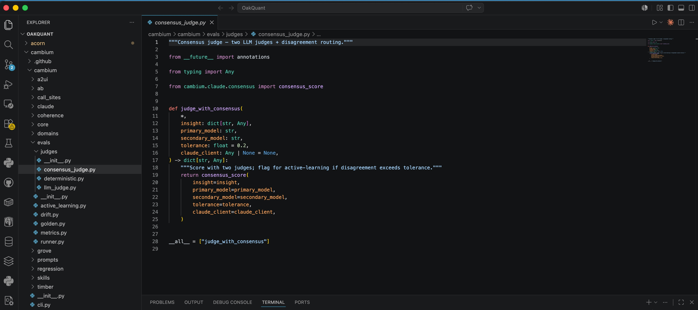

# The Work That Still Needs You

In the last few months I have started hearing from people I had not spoken to in years. The first minute is the good part, the real pleasure of a name I am glad to see again, and I do not want to pretend otherwise. Then the reason surfaces, and the call turns out not to be about reconnecting. It is a request for help.

I have stopped telling myself the flattering version, the one where they reached out because I am the person they trust most with this. They are reaching out to everyone. The same message went to a dozen other people the same week, in slightly different words, because that is what you do when you are frightened and out of ideas. You do not find the one right door. You knock on every door you can find, and mine is one of them.

The ground moved under them. They built careers on hard-won judgment and on the quiet, high-stakes work nobody notices until it goes wrong, and then they were told that the expertise was no longer the scarcity it used to be.

I want to be clear about where I stand when I pick up. I build these systems. I am part of the machinery that is changing what these roles are, not an outside observer offering sympathy. That is why my name is on the list at all, and it is why I owe them more than comfort.

-----

## What I will not do, and what I will

I am not going to tell you any of their stories. They did not call me to become someone's anecdote, and the details that would make a story vivid are the same details that would make a person recognizable. So I will do the one honest thing I can with what I have been told. I will describe the shape I see when I lay the calls beside each other, in my own words, as a pattern and not a person.

The shape is almost always the same. Someone who spent years learning how to turn messy intent into something real: a working flow, a sound design, a model that holds, a system that can survive contact with production. The kind of judgment that looks lighter from the outside than it really is and takes years to build. Their worth was never just the artifact they produced. It was the ability to see where the model would break, where the workflow would fail, where the elegant design on the screen would not survive the world. Then better assistants arrived, and more of the translation layer started getting automated. What got filed under friction was the exact thing that had been keeping the system honest.

-----

## Commodity and consequence

Here is what I tell them, and what I have watched hold true.

The machine has made the artifact cheap. It is extraordinary at the plausible deck, the competent memo, the clean line of code. It can help produce the design, the draft, the flow, the scaffold. It has no concept of consequence. It cannot be held responsible for what it makes, and it does not know when it is confidently wrong, because it does not know anything.

The valuable part of your career was the judgment you exercised before your name went on the work, never the work itself. That judgment did not get cheaper this year. It got scarcer, and worth more. We are walking into a world drowning in fluent, plausible, hollow output, and the thing that world will pay for is the one thing the machine cannot fake: a human willing to stand behind a decision.

That is the bad news. The good news is that everything that mattered about your work lives on the other side of that line.

-----

## Where you go from here

If you are sitting inside that fear, stop chasing the tool tricks. Stop studying the software that will be obsolete by spring. Stop thinking the latest prompt pattern or note-taking trick is the heart of the matter. Study the things the machine cannot be.

You will still learn tools. You have to. But learn them as instruments, not as the source of your value.

Learn to verify. If you spent years as an architect, a product engineer, a developer, a QA lead, or the quiet adult in the room, this is your work. Read what other people, and the machines, have built, not to produce it again but to audit it, because the world is filling up with perfect-looking output that is quietly wrong and running short of people who can tell the difference. Reclaim your depth instead of apologizing for it. A tool with no depth ships the error straight into the world, and your years are what catch it before it lands. And stand for something. The most human parts of the work, teaching the person behind you, being present when a decision is being weighed, carrying the weight when it goes wrong, knowing where the elegant design will break, are no longer the soft edges of the job. They are the job.

-----

## The work that remains

The person who finds their footing again is not the one who finds a new version of the old job. It is the one who accepts that the old map is gone and starts looking for the places where trust is the actual product.

I am not selling you a clean ending. The fear is real, the disruption is not finished, and it will not land softly for everyone. But there is a version of the next decade that needs more people who can be trusted with the consequences of an action, not fewer, and that role is open. Find the place where the machine's fluency ends and human accountability begins. Walk toward that edge. The years you thought were wasted were the training ground for the work that is indispensable.

I wrote the map for this transition in [Are You Worried About Your Job?](https://press.oakquant.ai/public/articles/career-org-of-the-future). This, the knowing and the judging and the standing firm, is the part of the map with a pulse.

— Pumulo Sikaneta
