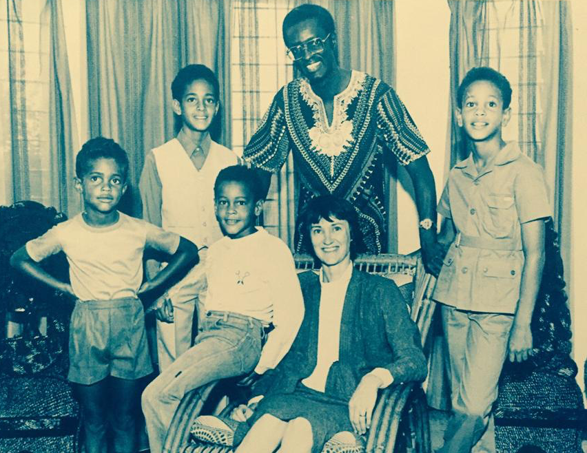

Father's Day turns the mind away from gifts and rituals and toward the quiet ways a life is formed.

My father was the oldest child, raised in Zambia, the first in his family to attend university in the United States and then medical school in Canada. He built a life through discipline, intellect, and hard work. He served as a physician, a Rotarian, a brother, a husband, and a father who kept showing up for his family and his community.

My mother carried a different kind of strength, but it belonged to the same moral world. She held together the emotional life of the family, the daily order of things, the conversations that gave form to who her children were becoming. If my father was part of the visible structure of our family story, my mother was the steady system underneath it, quietly making everything work.

When the mind returns to the people who most formed us, it is rarely their accomplishments that endure first. Not simply what they achieved, or what they provided, or how hard they worked.

It is the quality of spirit they brought into ordinary life.

Not perfection. Not performance. Not charisma. A durable orientation toward other people. A willingness to be inconvenienced for someone else. A belief that strength is not proven by dominance, but by service.

---

## The Architecture of Becoming

Here is something worth considering: the most powerful AI systems ever built are, at their core, prediction engines trained on human data.

A foundation model does not begin with intelligence. It begins with exposure. Billions of words, ideas, arguments, stories, and observations, written by people across centuries and cultures. The model processes this corpus and learns to predict: given what came before, what comes next? Given this context, what is the most likely continuation?

The training signal is the data. The data is us.

What the model learns to value, what it recognizes as coherent, what it weights as important, comes entirely from the patterns embedded in what it was shown. Feed it wisdom and precision and it begins to reason with nuance. Feed it cruelty and manipulation and it learns to replicate those too. The model has no independent judgment about which is better. It learns from what it is given.

This is not metaphor. This is the mechanism. And once you see it clearly, it becomes hard not to notice the same pattern in how people are formed.

And then I think about my father, and I realize: so were we.

---

## Back-Propagation and the People Who Corrected Us

Every child is born into a training environment.

Before we could speak in complete sentences, we were receiving signal. The warmth or coldness of an embrace. Whether our curiosity was met with patience or frustration. Whether the adults around us told the truth. Whether they treated the server at a restaurant the same way they treated a colleague. Whether they kept their word when it was inconvenient to do so.

We did not process these inputs consciously. But we stored them. And over thousands of repetitions across years, they built the prediction engine we were becoming.

In machine learning, there is a process called back-propagation. When a model makes a prediction that is wrong, an error signal travels backward through the network and adjusts the weights. The model is corrected. Over millions of such corrections, it becomes better at making accurate predictions.

Our parents and teachers and communities were doing this to us constantly.

Every time my father stayed calm when it would have been easier to lose his temper, that was a correction. Every time he chose to help someone who could not help him back, that was a signal. Every time he demonstrated that competence without character is incomplete, something in me was being adjusted.

The corrections that stayed with me most were not the dramatic ones. They were the repeated, quiet ones. The way he answered the phone when someone needed him, not with resentment, but with readiness. The way he talked about his patients, not as cases, but as people with names and families and dignity.

A hand on the shoulder before a difficult moment. A ride home where almost nothing was said, but everything was understood. The way he treated a stranger with respect when no one was watching.

These are the moments that become part of us.

This is how values are transmitted. Not through lectures. Through consistent demonstration over time.

---

## What "Best" Actually Means

Every AI system optimizes for a target. The entire discipline of alignment is grappling with one question: what should that target actually be?

My father was precise about this without ever articulating it as a framework. His internal model of "best" was not limited to professional achievement or social status. Best meant: did you use what you had to help someone who needed it? Did you do it without making them feel small? Did you leave people better than you found them?

That is a different objective function than the ones most systems are currently optimizing for.

The old line about great power and great responsibility is true, but incomplete. Responsibility is a constraint. It sets a floor on harm. A system can be entirely responsible, causing no measurable harm, and still be cold. Still be indifferent. Still process people efficiently without ever recognizing them as people.

What my father modeled was something beyond responsibility. An active orientation toward the well-being of others that went past not harming them and into genuinely wanting them to flourish.

Goodness asks more than responsibility. Goodness asks whether power is used in service of someone else. Goodness asks whether the strong know how to be gentle.

---

## The Curriculum of Character

Every teacher knows that what students learn is not always what is being taught.

A mathematics class teaches equations. It also teaches whether effort is rewarded, whether mistakes are punished or investigated, whether curiosity is welcomed or managed. These are lessons about what learning is for, and they form the student as much as any formula.

The same is true at scale. The institutions we build, the norms we enforce, the behaviors we celebrate or ignore: these are all training signal for the people developing inside them.

My father received a particular curriculum and then amplified it. He was formed by people who believed that education was a form of liberation, that service was a form of dignity, and that the point of capability was to use it on behalf of others. He internalized that curriculum so completely that he became a source of it for the next generation.

My mother gave that curriculum its daily texture. She was the one who kept the structure of care functioning across years, who modeled emotional steadiness alongside her own considerable strength, who made sure that the values we were absorbing had somewhere to land.

That is the transmission mechanism of values across time. Not inheritance. Not instruction. Lived example, repeated long enough to become pattern.

---

## Role Models as Training Data

There is a class of people who form others not through authority or instruction, but through example. They become a reference distribution. When you are uncertain how to act, you ask: what would they do?

This is how moral formation actually works. Not through rules. Through models.

Which is also, it turns out, how machine learning works. You do not encode a rule that says "be honest." You expose the system to enough examples of honesty, in enough varied contexts, that it learns the underlying pattern. The pattern then generalizes to new situations the system has never encountered.

The best parents and teachers are doing something analogous. They are not issuing policy. They are providing enough consistent signal, over enough time, across enough different situations, that the person being formed develops a genuine internal model of how to move through the world well.

My father's signal was: show up. Be of service. Expect nothing in return. Treat people as ends in themselves, not instruments of your own advancement. Be more interested in what you can contribute than in what you can accumulate.

I have been back-propagating on that signal my entire adult life.

---

## On Complicated Fathers and Other Teachers

Not everyone will read this day with simple warmth.

Not every father was present. Not every father was kind. Not every family story is uncomplicated. Sometimes it was a mother who carried both roles. Sometimes a grandfather, uncle, teacher, coach, or neighbor became the model that a biological father could not be.

That matters too.

What we are really honoring is not a title alone, but a pattern of love, sacrifice, steadiness, and moral witness. We are honoring those who trained us, through daily example, in what it means to become fully human.

The mechanism is the same regardless of who provided the signal. A person whose early environment was built on consistent care and high standards will carry that forward. A person whose early environment was defined by neglect or cruelty will spend years doing the harder work of rewriting those patterns.

This is why role models matter so much, and why their absence carries such real cost. We are not blank slates who arrive at our values through pure reasoning. We are prediction engines formed by the examples we were surrounded by. Changing the output requires going back and examining the training.

The most remarkable people I know who grew up without the fathers they deserved found their models somewhere else. They sought them out deliberately, or recognized them in retrospect. They built their own reference distributions from teachers, coaches, mentors, books, and the occasional stranger who treated them with unexpected dignity at a formative moment.

The signal got through. It just took longer, and cost more.

---

## What We Are Building

The systems we are creating now will increasingly mediate how people work, how they access opportunity, how they receive care, and how decisions are made at scale. They will be present at moments of confusion, vulnerability, and need.

If those systems are trained primarily on speed and engagement and measurable output, they will reflect those values. If they are trained with an explicit commitment to human dignity, to long-term well-being, to the small and often invisible acts of recognition that make people feel seen and supported, they will reflect those values instead.

We choose the training signal. That choice is design.

My father never spoke in the language of AI. He did not talk about objective functions or alignment or model behavior. But he understood something essential that many modern systems still fail to capture: capability is not the highest good.

Perhaps that is one way to think about alignment in a deeper sense. Not only building systems that avoid obvious harm, but building systems formed by the best examples we have known. Systems that reflect not only what humans can do, but what humans at their best choose to be.

Patience over needless escalation. Respect over manipulation. Helpfulness that preserves dignity. Intelligence that does not separate efficiency from humanity.

---

## Goodness Made Durable

On this day, the mind rests on the men and women whose daily habits became moral instruction.

On fathers who showed that real strength is often quiet. On mothers who gave those lessons continuity and form. On the other figures who stepped into the role when it was empty.

On the small moments that became lifelong reference points.

My father showed me that the most durable form of impact is not what you build or accumulate. It is the quality of care you bring to every person you encounter. He did not set out to influence how I think about ethics in technology. He set out to be a good doctor, a good father, a good man. But the signal he provided was so clear and so consistent that it became part of how I see everything.

We are building systems of extraordinary capability. The question I carry with me, formed by watching a man who had extraordinary capability and used it with extraordinary care, is whether we are building them to reflect the best of us.

Not just the most efficient version of us. Not just the most capable version.

The best version.

Today, I am grateful to have had a model who made that standard visible.

---

*Goodness made durable. That is what the best of them gave us. It is what we owe forward.*

---

*The Cost of the Machine trilogy asks what we lose when we remove human judgment from consequential systems. This piece is the other side of that question: what we preserve when we carry the right human values into what we build.*
